# Cave Game Codeflow Guide

This guide follows the project from the executable entry point into the
mission loop, agent threads, sensing, SLAM, terrain sharing, pathfinding, and
UI rendering. It is intended as a first-read map for a new developer.

Generated from the current worktree on 2026-06-19.

## 1. Big Picture

The game is a Pygame-based distributed-systems simulation. The user configures
a mission in menus, a cave is generated, and `MissionControl` coordinates a set
of drones and rovers that explore the cave using local sensing, local maps,
explicit sharing, and pathfinding.

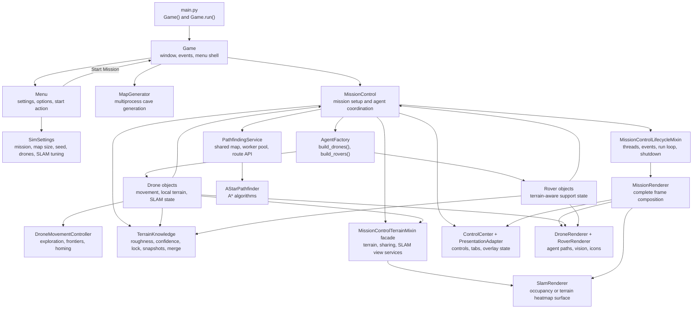

Core convention: map arrays are indexed as `map[y][x]`, while positions are
usually tuples of `(x, y)`. A cave cell value of `1` means wall and `0` means
floor.

## 2. Startup Call Stack

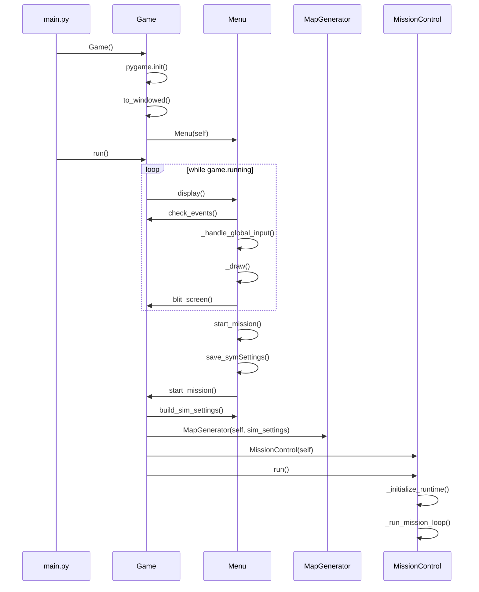

Entry point:

- `main.py`
  - imports `os` and `Game`
  - hides the Pygame support prompt with `PYGAME_HIDE_SUPPORT_PROMPT`
  - creates `Game()` and calls `game.run()`

Primary startup classes:

- `Game`
  - `__init__(self) -> None`: initializes Pygame, sets window state, creates `Menu`.
  - `run(self) -> NoReturn`: repeatedly calls `self.menu.display()`.
  - `start_mission(self) -> None`: builds `SimSettings`, creates one `MapGenerator`, then constructs and runs fresh `MissionControl` instances while restart is requested.
  - `check_events(self) -> None`: converts Pygame events into key flags consumed by menus.
  - `blit_screen(self) -> None`: blits the internal display to the window and resets key flags.

- `Menu`
  - `display(self) -> None`: nested menu loop for input, draw, and blit.
  - `build_sim_settings(self) -> SimSettings`: converts selected menu values into the runtime settings dataclass.
  - `start_mission(self) -> None`: saves settings and calls `Game.start_mission()`.

## 3. Menu and Settings Flow

`Menu` owns the interactive setup screens and persists configuration through
`configparser`.

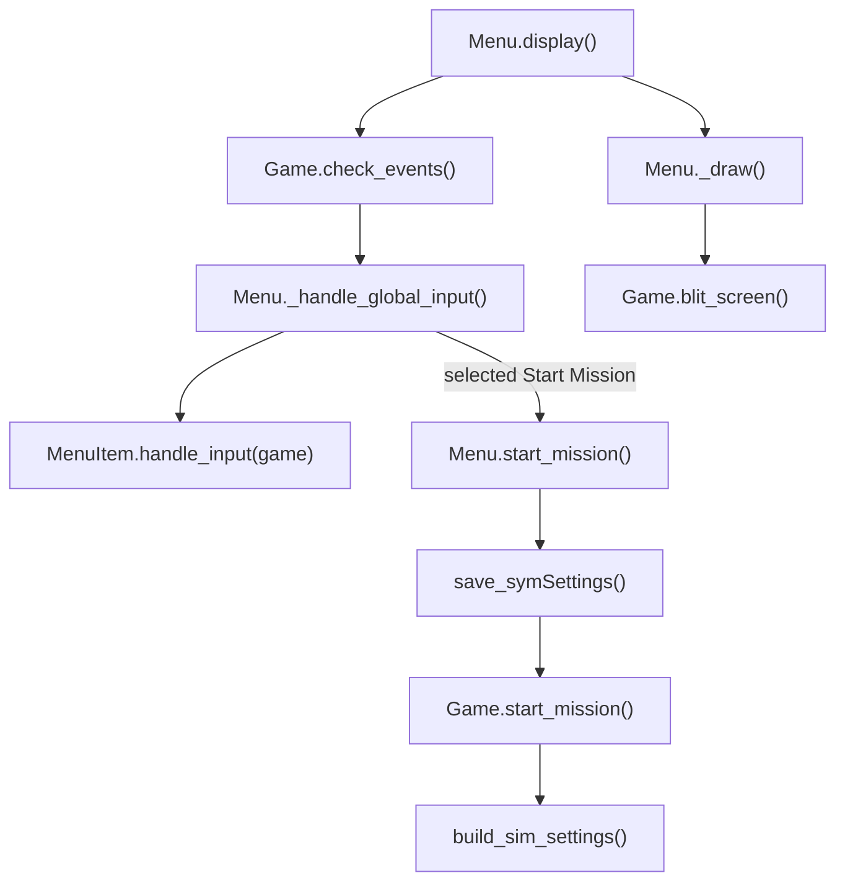

Important types and arguments:

- `MenuItem.__init__(game, label, position, item_type, action=None, value=None, options=None, size=35, font_big=False, alignment='midleft', selectable=None, text_input=None)`
  - stores per-row state for title, button, selector, text input, or slider rows.
- `MenuItem.handle_input(game) -> bool`
  - consumes `LEFT_KEY`, `RIGHT_KEY`, number keys, and backspace.
  - returns `True` when the item value changed.
- `SimSettings`
  - dataclass fields: `mission`, `map_dim`, `seed`, `num_drones`, `slam_scan_interval`, `slam_scan_rays`, `slam_point_cloud_max_points`, `slam_render_point_tail`, `slam_render_interval`, `rover_share_interval`, `frontier_stride`, `frontier_confidence_threshold`, `frontier_rebuild_cooldown`.

Libraries used here:

- `pygame` and `pygame.mixer`: rendering, input, fonts, audio.
- `configparser`: reads/writes `GameConfig/options.ini` and `GameConfig/symSettings.ini`.
- `pathlib.Path` and `os`: asset and config paths.

## 4. Cave Generation Flow

`MapGenerator` is created before `MissionControl`; it builds the binary cave
map and roughness map that all later systems use.

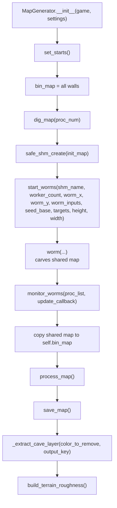

Key methods:

- `MapGenerator.__init__(game, settings) -> None`
  - stores display dimensions, creates deterministic `np.random.Generator`, derives `worm_inputs`, initializes `bin_map`, runs generation, saves assets, and builds `terrain_roughness`.

- `dig_map(self, proc_num: int) -> None`
  - limits workers to `os.cpu_count()`.
  - creates a shared-memory map using `safe_shm_create(init_map)`.
  - starts worker processes with `start_worms(...)`.
  - waits via `monitor_worms(proc_list, update_callback)`.
  - copies the shared-memory result into `self.bin_map`.
  - closes/unlinks shared memory with `safe_shm_close(shm)`.

- `process_map(self) -> None`
  - applies OpenCV median blur.
  - calls `remove_hermit_caves(image)`.
  - merges raw and cleaned maps.
  - calls `add_wall_transition_noise(image, width, height, seed, worm_inputs)`.

- `build_terrain_roughness(self) -> None`
  - creates a floor-only `float32` roughness map in `[0, 1]`.
  - combines smooth noise, wall-distance bias, and clustered noise.

Important helper functions in `MapGenHelpers.py`:

- `safe_shm_create(init_map: np.ndarray)` -> shared memory object and ndarray view.
- `safe_shm_close(shm) -> None` -> closes and unlinks shared memory.
- `start_worms(shm_name, worker_count, worm_x, worm_y, worm_inputs, seed_base, targets, height, width) -> list[Process]`.
- `worm(shm_name, height, width, start_x, start_y, step, stren, life, wid, seed, worm_x_list, worm_y_list, targets_list) -> None`.
- `apply_cv_brush(sub, cx, cy, mode_choice, stren, rng=None) -> None`.
- `monitor_worms(proc_list, update_callback, poll_interval=0.05) -> bool`.
- `border_control_helper(...) -> int` and `homing_helper(...) -> int` steer carving direction.

Libraries used here:

- `numpy`: matrix storage, random generation, masks, normalization.
- `opencv-python` as `cv2`: blur, connected components, distance transform, image writes.
- `multiprocessing.Process` and `multiprocessing.shared_memory`: parallel cave carving.
- `pygame`: loading/saving map layers and loading screen updates.

## 5. Mission Setup

`MissionControl` is the central coordinator. It inherits:

- `MissionControlTerrainMixin`: compatibility facade for terrain, sharing, rover target, SLAM view, and debug services.
- `MissionControlLifecycleMixin`: mission loop, thread startup, shutdown.

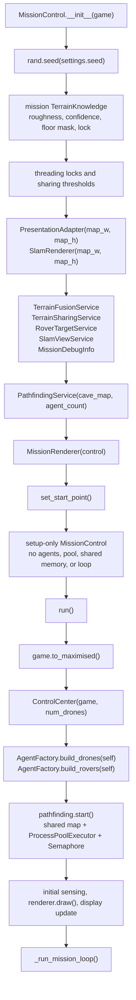

Important `MissionControl.__init__(game)` setup state:

- `self.map_matrix`: binary cave map from `game.cartographer.bin_map`.
- `self.terrain_roughness`: source roughness map from `MapGenerator`.
- `self.terrain_knowledge`: mission telemetry aggregate owning roughness, confidence, floor mask, and synchronization; active agent decisions must not read it.
- `self.known_roughness`, `self.terrain_confidence`, `self.terrain_lock`, and `self.floor_mask`: compatibility properties backed by `terrain_knowledge`.
- `self.pathfinding`: allocation-free `PathfindingService`; its worker pool and shared memory are created by `start()`.
- `self.map_shm`, `self.map_shape`, `self.pool`, and `self.pool_sem`: compatibility properties that expose service-owned resources.
- `self.presentation`: overlay state object.
- `self.slam_renderer`: cached surface renderer for occupancy/roughness.
- `self.terrain_fusion`, `self.terrain_sharing`, `self.rover_targets`, `self.slam_view`, `self.debug_info`: focused services created by `_init_terrain_services()`.
- `self.frame_profiler`: smoothed main-loop and stage timing telemetry.
- `self.renderer`: scene-level `MissionRenderer`; `MissionControl.draw()` remains a compatibility wrapper.
- `self.rover_motion_enabled = False`: rover movement code exists but rover threads are disabled by default in the current code.

`MissionControl.run()` initializes:

- maximized mission window and control center,
- drone and rover objects,
- pathfinding shared memory, process pool, and semaphore through `PathfindingService.start()`,
- initial sensor state and first rendered frame,
- agent worker threads and the blocking mission loop.

`AgentFactory` call path:

- `AgentFactory.build_drones(control) -> None`
  - sets `control.num_drones`.
  - loads/scales one drone icon.
  - creates `Drone(game, control, id, start_point, color, icon, map_matrix)` for each drone.

- `AgentFactory.build_rovers(control) -> None`
  - sets `control.num_rovers = ceil(num_drones / 4)`.
  - loads/scales one rover icon.
  - creates `Rover(game, control, id, start_point, color, icon, map_matrix)`.
  - rover construction creates its own `TerrainKnowledge`.

## 6. Mission Runtime Loop

The lifecycle mixin starts drone threads, optionally starts rover threads, and
keeps the main thread responsible for events, sensing, and drawing.

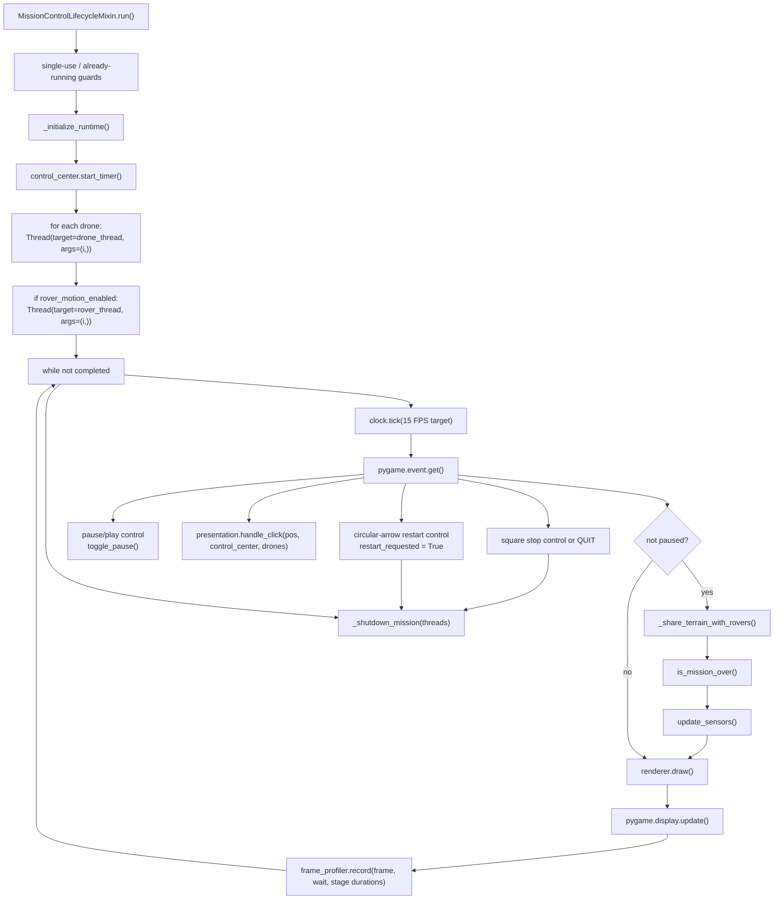

After shutdown, STOP and normal completion return to the windowed menu.
RESTART leaves the display in mission mode and returns control to
`Game.start_mission()`, which creates a fresh single-use `MissionControl`
against the existing `SimSettings` and `MapGenerator` result.

Key methods:

- `run(self) -> None`
  - rejects concurrent or repeated execution.
  - calls `_initialize_runtime()`.
  - creates `threading.Thread` objects for drones.
  - processes `QUIT`, stop-button clicks, and control-center clicks.
  - calls `_share_terrain_with_rovers()`.
  - checks completion with `is_mission_over()`.
  - calls `update_sensors()` on the main thread.
  - draws and updates display.
  - always calls `_shutdown_mission(threads)` in `finally`.
  - restores the windowed view after shutdown.

- `start_mission(self) -> None`
  - compatibility alias for `run()`.

- `is_mission_over(self) -> bool`
  - returns true only if every drone reports `mission_completed()`.

- `_shutdown_mission(self, threads: list[threading.Thread]) -> None`
  - sets `mission_event`.
  - joins agent threads.
  - calls `PathfindingService.shutdown()` to release the process pool and shared memory.

Concurrency model:

- Main thread: Pygame event loop, sensor updates, rendering, global rover sharing.
- Drone threads: drone movement and drone-to-drone sharing.
- Optional rover threads: rover target acquisition and movement.
- Process pool workers: A* pathfinding using shared-memory map.

## 7. Drone Movement Call Stack

Drone movement is driven by `MissionControl.drone_thread(drone_id)`.

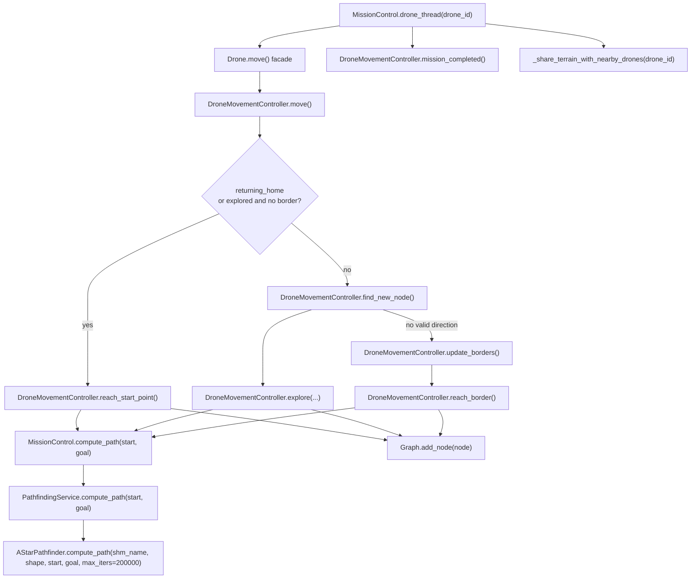

Important drone methods and arguments:

- `Drone.__init__(game, control, id: int, start_pos: tuple[int, int], color: tuple[int, int, int], icon: pygame.Surface, cave: list) -> None`
  - stores mission settings, shared agent state, local terrain arrays, locks, graph, SLAM map, and movement/sensor/renderer collaborators.

- `DroneMovementController.move() -> None`
  - if done, returns.
  - if returning home or exploration is exhausted, calls `reach_start_point()`.
  - otherwise tries `find_new_node()` and `explore(...)`.
  - if no local node is available, calls `update_borders()` and `reach_border()`.

- `DroneMovementController.find_new_node() -> tuple[list[int], list[tuple[int, int]], tuple[int, int]]`
  - scans directions from 0 to 359 degrees.
  - uses `next_cell_coords(x, y, step_len, direction)`.
  - validates candidates with `Graph.is_valid(curr_pos, candidate_pos)`.
  - chooses a valid direction randomly.

- `DroneMovementController.explore(valid_dirs, valid_targets, chosen_target) -> bool`
  - adds valid targets to `self.border`.
  - calls `control.compute_path(self.pos, chosen_target)`.
  - follows the returned path, updating heading and graph history.

- `DroneMovementController.reach_border() -> bool`
  - sorts frontiers by distance.
  - calls `control.compute_path(self.pos, target)` for candidates.
  - follows the first useful path.

- `DroneMovementController.reach_start_point() -> bool`
  - calls `control.compute_path(self.pos, self.start_pos)`.
  - follows path home and returns whether the drone reached start.

- `DroneMovementController.rebuild_frontiers(stride=4, confidence_threshold=0.6) -> None`
  - derives frontiers from local SLAM occupancy, SLAM confidence, local terrain confidence, and cave floor mask.

- `Drone.move()`, `Drone.reach_border()`, and the other former movement methods
  - remain as compatibility wrappers around `DroneMovementController`.

Support methods/classes:

- `Graph.__init__(x_start, y_start, cave_mat) -> None`
  - stores visited positions and cave matrix.
- `Graph.is_valid(curr_pos, candidate_pos) -> bool`
  - checks `wall_hit(...)` and `cross_obs(...)`.
- `Graph.cross_obs(x1, y1, x2, y2) -> bool`
  - Bresenham line check for wall crossings.

## 8. Sensing, SLAM, and Terrain Sampling

Movement remains threaded, while sensing is an explicit main-thread update.
Rendering consumes the latest ray endpoints but does not mutate SLAM or terrain
state.

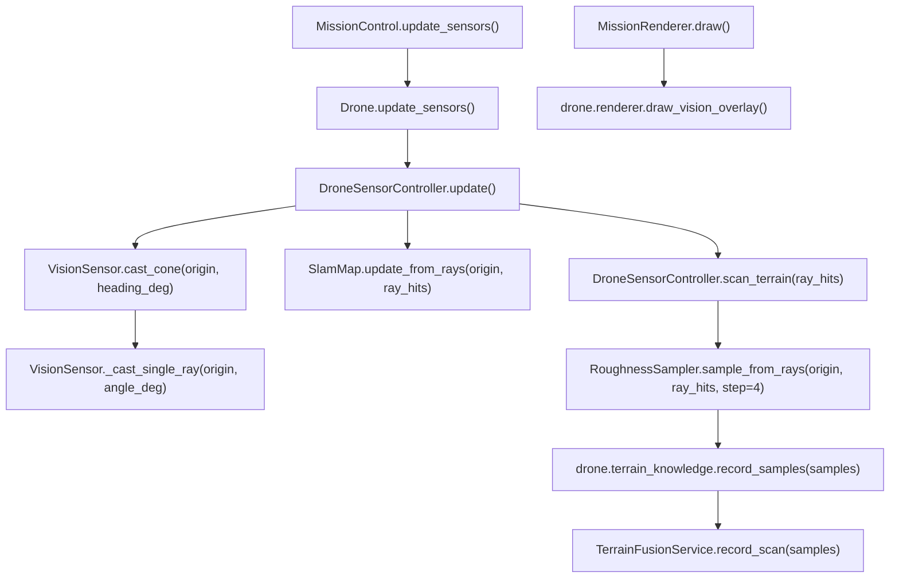

Important sensing types:

- `DroneSensorController.__init__(drone) -> None`
  - owns the `VisionSensor`, `RoughnessSampler`, scan interval, and scan timestamp.

- `DroneSensorController.update() -> None`
  - casts rays, updates `drone.ray_points`, updates local SLAM, and triggers terrain sampling.

- `Drone.update_sensors() -> None`
  - delegates the simulation update to its sensor controller.

- `VisionSensor.__init__(map_matrix, fov_deg=60.0, num_rays=60, step=2) -> None`
  - prepares ray count, field of view, step size, and max range.

- `VisionSensor.cast_cone(origin, heading_deg) -> list[RayHit]`
  - casts `num_rays` across the field of view.

- `RayHit`
  - dataclass fields: `end`, `hit`, `distance`, `angle_deg`.

- `SlamMap.__init__(map_h, map_w, max_points=6000) -> None`
  - allocates occupancy grid, confidence grid, and sparse point cloud.

- `SlamMap.update_from_rays(origin, ray_hits) -> None`
  - marks free cells along each ray.
  - marks the endpoint occupied when the ray hit a wall.
  - updates point cloud and dirty flag.

- `RoughnessSampler.__init__(terrain_roughness, map_matrix) -> None`
  - stores source roughness and map geometry.

- `RoughnessSampler.sample_from_rays(origin, ray_hits, step=4) -> list[tuple[int, int, float, float]]`
  - samples roughness along visible floor cells.
  - returns `(x, y, roughness, confidence)` tuples.

- `DroneSensorController.scan_terrain(ray_hits) -> None`
  - throttles scans using `slam_scan_interval`.
  - calls `RoughnessSampler.sample_from_rays(...)`.
  - calls `drone.terrain_knowledge.record_samples(...)` for local knowledge.
  - delegates mission-global fusion to `TerrainFusionService`.

- `Drone.draw_vision_overlay() -> None`
  - draws the latest `ray_points`.
  - does not cast rays or update SLAM/terrain state.

## 9. Distributed Terrain and SLAM Sharing

Distributed terrain follows four ownership rules:

1. Drone decisions read that drone's local terrain and SLAM knowledge.
2. Mission terrain is an aggregate for progress telemetry and combined UI
   rendering, not an agent knowledge source.
3. Local knowledge moves between agents only through explicit sharing.
4. Rover target and route logic is provisional while rover motion is disabled;
   it must be converted to rover-local received knowledge before activation.

Mission control, every drone, and every rover own distinct `TerrainKnowledge`
instances. `TerrainSharingService` decides when transfers occur, while
`TerrainKnowledge` owns snapshots and the confidence-weighted merge rule.

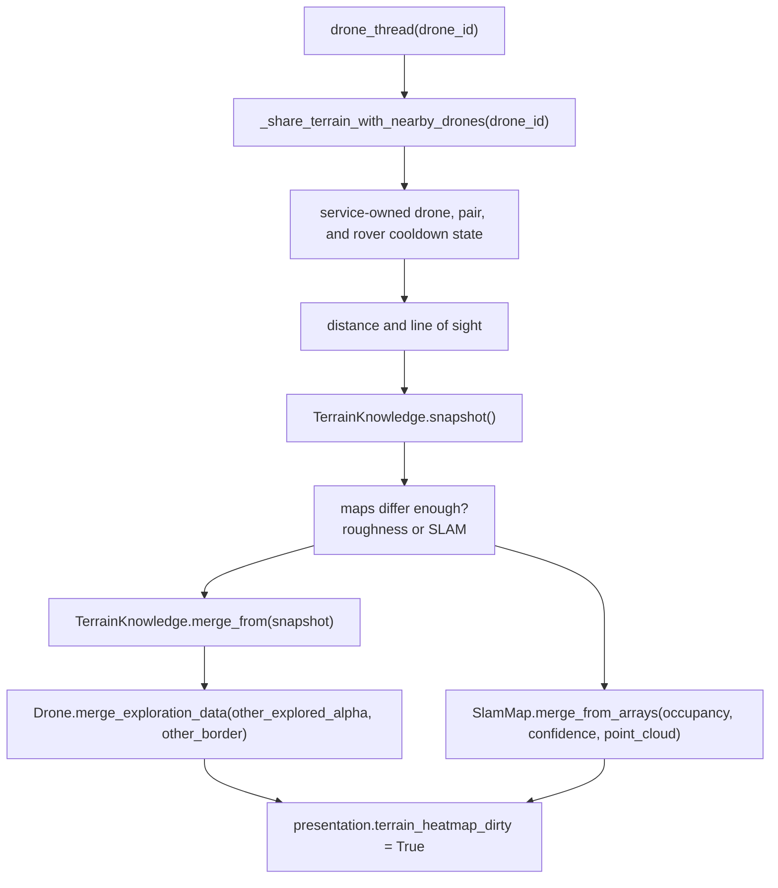

Key sharing methods:

- `TerrainSharingService.share_with_nearby_drones(drone_id) -> None`
  - owns and throttles per-drone and per-pair schedules.
  - atomically reserves pair processing so concurrent drone workers cannot
    exchange the same pair twice within one cooldown window.
  - checks distance against each drone radius.
  - requires `_has_line_of_sight(a, b)`.
  - compares local roughness/confidence via `_maps_differ_enough(...)`.
  - compares SLAM occupancy/confidence via `_slam_maps_differ_enough(...)`.
  - exchanges `TerrainSnapshot` values through `TerrainKnowledge.merge_from(...)`.
  - uses `Drone.merge_exploration_data(...)` and `SlamMap.merge_from_arrays(...)` for frontier and occupancy state.

- `TerrainSharingService.maps_differ_enough(source_roughness, source_confidence, target_roughness, target_confidence) -> bool`
  - samples maps using `share_compare_stride`.
  - returns true when the source adds enough new information or enough changed overlapping roughness.

- `TerrainSharingService.slam_maps_differ_enough(source_occ, source_conf, target_occ, target_conf) -> bool`
  - equivalent comparison for occupancy/confidence maps.

- `TerrainSharingService.share_with_rovers() -> None`
  - shares drone terrain to rovers when close enough and line-of-sight is clear.
  - is called from the main mission loop but only performs proximity checks and map snapshots when `rover_share_interval` has elapsed.
  - defaults to a 0.5-second interval even though rover motion is disabled by default.

- `TerrainFusionService.record_scan(samples) -> None`
  - records samples through mission-global `TerrainKnowledge`.
  - updates `control_center.explored_percent`.
  - marks the heatmap dirty.

Merge rule summary:

- Roughness maps are confidence-weighted averages.
- Confidence values are capped at `1.0`.
- SLAM occupancy uses confidence dominance: higher-confidence source cells overwrite lower-confidence target cells.
- Frontier lists are merged, then rebuilt from current SLAM state.

## 10. Pathfinding

`PathfindingService` owns pathfinding resource lifecycle and dispatch. Drone
pathfinding uses its shared-memory process pool, while rover pathfinding is
terrain-aware and computed in-process through the same service API.

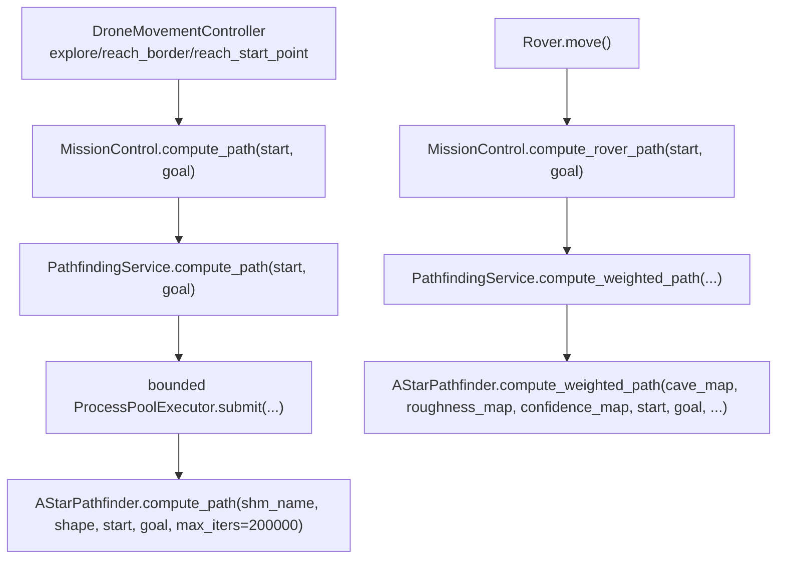

`PathfindingService(cave_map, agent_count)`

- `start()` copies the cave map into shared memory and creates a bounded worker pool.
- `compute_path(start, goal)` submits drone A* and blocks for its result.
- `compute_weighted_path(roughness_map, confidence_map, start, goal)` delegates rover routing to the weighted algorithm.
- `shutdown()` idempotently closes the pool and closes/unlinks shared memory.
- Construction is allocation-free so `MissionControl.__init__()` remains setup-only.

`AStarPathfinder.compute_path(shm_name, shape, start, goal, max_iters=200000) -> list[tuple[int, int]]`

- Attaches to `multiprocessing.shared_memory.SharedMemory(name=shm_name)`.
- Treats `arr[y, x] == 0` as traversable.
- Uses 8-neighbor movement.
- Uses an octile-distance heuristic.
- Prevents tight diagonal corner cutting when both adjacent orthogonal cells are walls.
- Returns a path from start to goal, inclusive, or `[]`.

`AStarPathfinder.compute_weighted_path(cave_map, roughness_map, confidence_map, start, goal, max_iters=200000, roughness_weight=4.0, unknown_penalty=2.5, low_confidence_penalty=1.5) -> list[tuple[int, int]]`

- Uses the same 8-neighbor A* structure.
- Adds cost for unknown cells.
- Adds cost for rough cells.
- Adds cost for low-confidence terrain observations.
- Used by rovers through `MissionControl.compute_rover_path(start, goal)`.

## 11. Rover Flow

Rover movement is present but disabled by default because
`MissionControl.rover_motion_enabled` is currently set to `False`.
The current target selection and weighted routing read mission telemetry and
are retained only as provisional scaffolding. They are not the final
distributed rover semantics and must not be enabled unchanged.

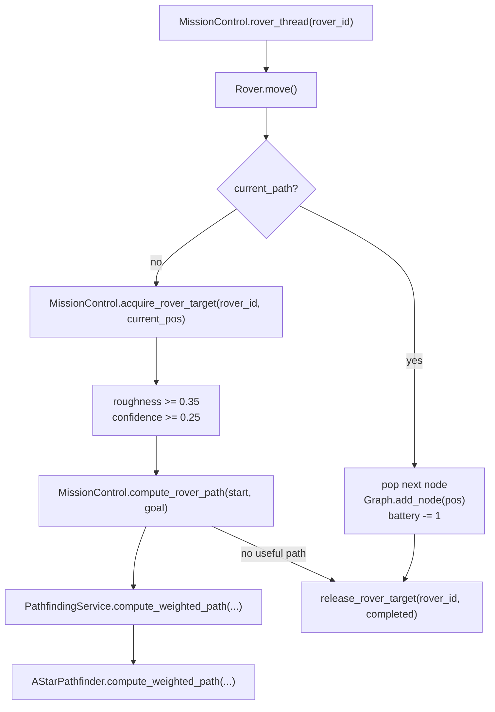

Important methods:

- `Rover.__init__(game, control, id, start_pos, color, icon, cave) -> None`
  - stores mission settings, draw state, battery, path history, target, graph.

- `Rover.move(self) -> None`
  - if `current_path` exists, advances one point and drains battery.
  - otherwise asks the controller for a target and terrain-aware path.

- `MissionControlTerrainMixin.acquire_rover_target(rover_id, current_pos) -> tuple[int, int] | None`
  - finds rough, known floor cells.
  - excludes assigned and completed targets.
  - scores by roughness, confidence, and distance.

- `MissionControlTerrainMixin.release_rover_target(rover_id, completed=False) -> None`
  - releases assignment and optionally marks target complete.

## 12. Rendering and UI Flow

`MissionRenderer.draw()` owns the main visual layering. It always starts with
a black canvas and a SLAM/terrain surface rather than the ground-truth cave
image. `MissionControl.draw()` remains as a compatibility wrapper.
Agent-specific Pygame operations are delegated to renderer objects.

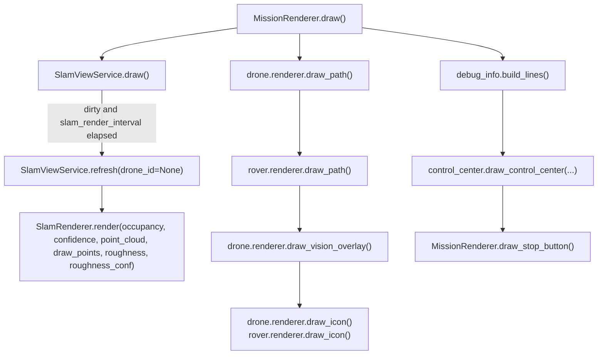

Overlay state and click flow:

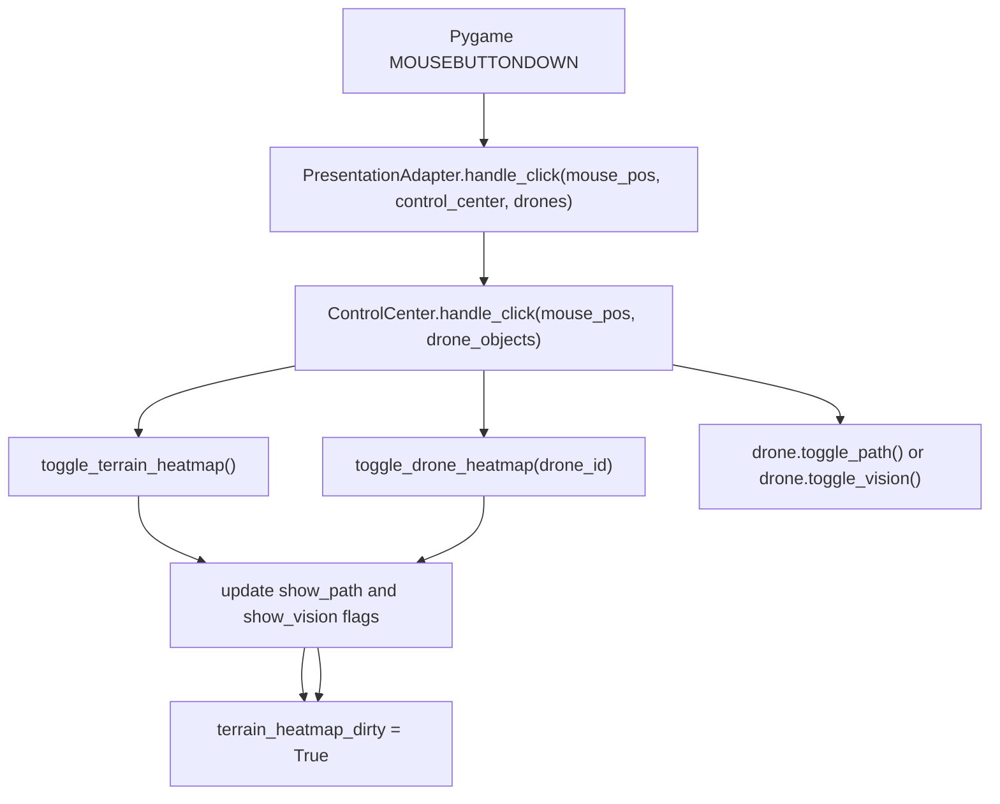

Important UI classes:

- `PresentationAdapter(map_w, map_h)`
  - stores `show_terrain_heatmap`, `selected_drone_heatmap_id`, `terrain_heatmap_dirty`, and a heatmap surface.
  - routes click results from `ControlCenter.handle_click(...)`.

- `ControlCenter(game, num_drones)`
  - owns control-panel geometry, tab state, cached fonts/surfaces, and interactive rectangles.
  - exposes `draw_control_center(drone_objects, rover_objects=None, show_terrain_heatmap=True, selected_drone_heatmap_id=None, debug_lines=None)`.

- `ControlCenterRenderer`
  - orchestrates the control-panel draw order.
  - delegates text/caching details back to `ControlCenter`.

- `SlamRenderer(map_w, map_h)`
  - owns a Pygame surface.
  - renders either occupancy/confidence or terrain roughness/confidence.

- `MissionRenderer(control)`
  - owns complete frame composition and the stop-button rectangle/visual.
  - delegates map, agent, debug, and control-center layers to focused collaborators.

- `DroneRenderer(drone)` and `RoverRenderer(rover)`
  - own agent-specific Pygame surfaces.
  - draw paths, vision overlays, and centered agent icons.
  - read agent state without owning movement, sensing, or sharing logic.

## 13. Library and Module Dependency Map

External and standard libraries by responsibility:

- Pygame: window, display surfaces, fonts, input, image loading/saving, audio.
- NumPy: cave arrays, masks, confidence maps, roughness maps, shared-memory array views.
- OpenCV (`cv2`): map smoothing, connected components, distance transform, image writes.
- `multiprocessing` and `multiprocessing.shared_memory`: map generation workers and A* shared map.
- `concurrent.futures.ProcessPoolExecutor`: drone A* worker pool.
- `threading`: drone/rover threads, locks, mission stop event, semaphore.
- `heapq`: A* open set.
- `math`: distances, angles, heuristics, trigonometry.
- `random`: drone direction choice, agent colors, mission seed.
- `configparser`: menu settings persistence.
- `dataclasses`: `SimSettings`, `POI`, `RayHit`, UI state holders.
- `pathlib.Path` and `os`: resource and config paths.
- `logging`: non-fatal diagnostics.

Internal module relationships:

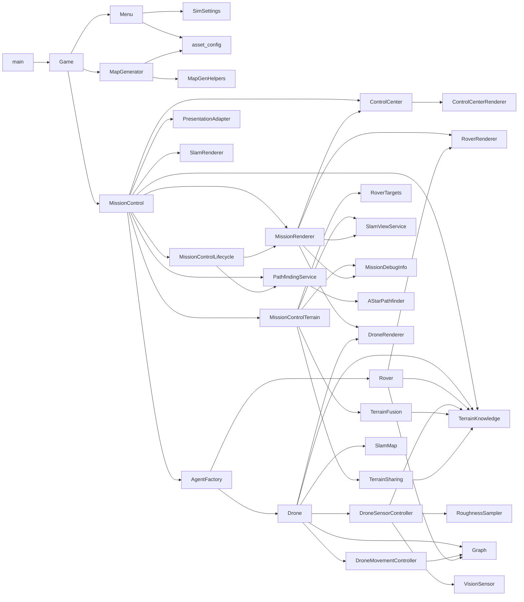

## 14. Module Reference

### `main.py`

- Libraries: `os`; internal `Game`.
- Calls: `Game()`, `Game.run()`.
- Use it as the executable entry point.

### `Game.py`

- Libraries: `os`, `sys`, `pygame`, `typing.NoReturn`.
- Internal imports: `Display`, `Images`, `MapGenerator`, `MissionControl`, `Menu`.
- Class: `Game`
  - `__init__(self)`: initializes Pygame, key flags, window, and menu.
  - `run(self)`: menu loop.
  - `start_mission(self)`: creates settings, map generator, and mission controller.
  - `check_events(self)`: maps Pygame events to `UP_KEY`, `DOWN_KEY`, `START_KEY`, `BACK_KEY`, `LEFT_KEY`, `RIGHT_KEY`.
  - `reset_keys(self)`, `blit_screen(self)`, `_setup_window(self, width, height)`, `to_maximised(self)`, `to_windowed(self)`.

### `Menu.py`

- Libraries: `os`, `configparser`, `logging`, `Enum`, `typing`, `pygame`, `pygame.mixer`, `Path`.
- Internal imports: `Display`, `GameOptions`, `Audio`, `Images`, `Colors`, `Fonts`, `SimSettings`.
- Classes:
  - `MenuItemType(Enum)`: `TITLE`, `BUTTON`, `SELECTOR`, `TEXT_INPUT`, `SLIDER`.
  - `MenuItem`: stores and draws a single menu row.
  - `Menu`: creates menus, handles menu input, persists settings, starts missions.
- Main methods:
  - `Menu.display()`, `_handle_global_input()`, `_draw()`, `build_sim_settings()`, `start_mission()`.

### `SimSettings.py`

- Library: `dataclasses.dataclass`.
- Class: `SimSettings`.
- Data-only mission configuration. Passed from `Menu` to `MapGenerator` and `MissionControl`.

### `MapGenerator.py`

- Libraries: `os`, `logging`, `Path`, `typing.Tuple`, `numpy`, `cv2`, `pygame`.
- Internal imports: display/config enums, media paths, colors, map-gen helpers.
- Function: `_image_path_from_key(key: str) -> Path`.
- Class: `MapGenerator`
  - `__init__(game, settings)`, `dig_map(proc_num)`, `set_starts()`, `set_ends(step, id)`, `connect_rooms(x, y, step, stren, id)`, `process_map()`, `build_terrain_roughness()`, `_extract_cave_layer(color_to_remove, output_key)`, `save_map()`.

### `MapGenHelpers.py`

- Libraries: `math`, `logging`, `contextmanager`, `time`, `multiprocessing.Process`, `multiprocessing.shared_memory`, `numpy`, `cv2`, `pygame`.
- Internal imports: `next_cell_coords`, `MapGen`.
- Functions:
  - `with_surfarrays(surface)`
  - `apply_cv_brush(sub, cx, cy, mode_choice, stren, rng=None)`
  - `remove_hermit_caves(image)`
  - `add_wall_transition_noise(image, width, height, seed, worm_inputs)`
  - `safe_shm_create(init_map)`
  - `safe_shm_close(shm)`
  - `worm(shm_name, height, width, start_x, start_y, step, stren, life, wid, seed, worm_x_list, worm_y_list, targets_list)`
  - `start_worms(shm_name, worker_count, worm_x, worm_y, worm_inputs, seed_base, targets, height, width)`
  - `monitor_worms(proc_list, update_callback, poll_interval=0.05)`
  - `border_control_helper(...)`
  - `homing_helper(rng, x, y, target_x, target_y)`
  - `make_derangement(n, rng)`

### `MissionControl.py`

- Libraries: `random`, `threading`, `typing`, `numpy`, `pygame`.
- Internal imports: `wall_hit`, `AgentFactory`, `ControlCenter`, `TerrainKnowledge`, `PathfindingService`, `PresentationAdapter`, `SlamRenderer`, `MissionRenderer`, terrain/lifecycle mixins.
- Class: `MissionControl(MissionControlTerrainMixin, MissionControlLifecycleMixin)`
  - `__init__(game)`: setup-only mission state construction.
  - `_initialize_runtime()`: window, control center, agents, resources, and first frame.
  - `_setup_pathfinding_resources()`: compatibility wrapper for `pathfinding.start()`.
  - `set_start_point()`: picks a floor cell from worm starts.
  - `drone_thread(drone_id)`: moves one drone and triggers nearby sharing.
  - `compute_path(start, goal)`: delegates drone routing to `PathfindingService`.
  - `compute_rover_path(start, goal)`: copies terrain state and delegates weighted routing.
  - `toggle_terrain_heatmap()`, `toggle_drone_heatmap(drone_id)`.
  - `rover_thread(rover_id)`.
  - `update_sensors()`.
  - `draw_stop_button()`, `draw()`: compatibility wrappers around `MissionRenderer`.

### `MissionControlLifecycle.py`

- Libraries: `threading`, `time`, `typing.List`, `pygame`.
- Class: `MissionControlLifecycleMixin`
  - `is_mission_over()`
  - `_shutdown_mission(threads)`
  - `_start_agent_threads()`
  - `_run_mission_loop()`
  - `run()`
  - `start_mission()`
- The main loop records frame wait, events, sharing, mission-status, sensing,
  rendering, and display durations through `FrameProfiler`.
- The square control completes the run normally. The circular-arrow control sets `restart_requested`, completes
  the run, performs normal worker/resource cleanup, and skips the intermediate
  windowed-menu transition.
- The pause/play control gates agent threads and skips sharing, completion, and
  sensor updates while rendering and event handling continue.

### `MissionControlTerrain.py`

- Libraries: `typing`, `numpy`.
- Internal imports: terrain, rover-target, SLAM-view, and debug-info services.
- Class: `MissionControlTerrainMixin`
  - `_init_terrain_services()`
  - `_ensure_terrain_services()`
  - `build_debug_lines()`
  - `record_terrain_scan(samples)`
  - `toggle_terrain_heatmap()`
  - `toggle_drone_heatmap(drone_id)`
  - `_update_visibility_state()`
  - `_has_line_of_sight(a, b)`
  - `_maps_differ_enough(source_roughness, source_confidence, target_roughness, target_confidence)`
  - `_slam_maps_differ_enough(source_occ, source_conf, target_occ, target_conf)`
  - `_share_terrain_with_nearby_drones(drone_id)`
  - `_share_terrain_with_rovers()`
  - `_refresh_slam_map(drone_id=None)`
  - `draw_terrain_heatmap()`
  - `acquire_rover_target(rover_id, current_pos)`
  - `release_rover_target(rover_id, completed=False)`

### `mapping/terrain_knowledge.py`

- Libraries: `threading`, `dataclasses`, `typing`, `numpy`.
- Dataclass: `TerrainSnapshot(roughness, confidence)`.
- Function: `fuse_terrain_samples(roughness, confidence, cave_map, samples)`.
- Class: `TerrainKnowledge`
  - `record_samples(samples)`
  - `snapshot()`
  - `merge_from(snapshot)`
  - `known_mask(threshold=0.0)`
  - `explored_ratio(threshold=0.0)`
- Owns terrain arrays, floor masking, synchronization, snapshot isolation, observation fusion, and confidence-weighted merging.

### `mapping/terrain_fusion.py`

- Libraries: `typing`, `pygame`.
- Re-exports: `TerrainSample`, `fuse_terrain_samples`.
- Class: `TerrainFusionService`
  - `record_scan(samples)`
- Records samples into mission `TerrainKnowledge` for telemetry and combined
  rendering without transferring or mutating agent-local knowledge.

### `agents/drone_movement.py`

- Libraries: `math`, `random`, `time`, `typing`, `numpy`.
- Internal imports: `FREE`, `next_cell_coords`.
- Class: `DroneMovementController`
  - `move()`
  - `reach_start_point()`
  - `find_new_node()`
  - `explore(valid_dirs, valid_targets, chosen_target)`
  - `reach_border()`
  - `update_borders()`, `maybe_rebuild_frontiers()`, `rebuild_frontiers(...)`
  - `mission_completed()`
  - `get_distance(target)`, `update_heading(previous, current)`
- Owns exploration policy, frontier retry/cooldown state, A* traversal, and homing behavior.

### `mapping/drone_sensor.py`

- Libraries: `time`, `typing`, `numpy`.
- Internal imports: `RoughnessSampler`, `VisionSensor`, `TerrainSample`.
- Class: `DroneSensorController`
  - `update()`
  - `scan_terrain(ray_hits)`
  - `record_local_scan(samples)`
- Owns ray casting, local SLAM updates, and local/global terrain sampling.

### `mapping/terrain_sharing.py`

- Libraries: `math`, `threading`, `time`, `typing`, `numpy`.
- Class: `TerrainSharingService`
  - `has_line_of_sight(a, b)`
  - `maps_differ_enough(...)`
  - `slam_maps_differ_enough(...)`
  - `share_with_nearby_drones(drone_id)`
  - `share_with_rovers()`
- Owns proximity, synchronized drone/pair/rover cooldown state, terrain
  sharing, and SLAM sharing rules.
- Rover sharing defaults to a 0.5-second cooldown so full terrain snapshots
  are not copied every frame.

### `mapping/rover_targets.py`

- Libraries: `math`, `typing`, `numpy`.
- Class: `RoverTargetService`
  - `acquire(rover_id, current_pos)`
  - `release(rover_id, completed=False)`
- Owns target scoring and reservation for rough terrain rover goals.

### `rendering/slam_view.py`

- Libraries: `time`, `typing`, `numpy`.
- Class: `SlamViewService`
  - `refresh(drone_id=None)`
  - `draw()`
- Owns combined/per-drone SLAM and terrain heatmap surface orchestration.
- Rebuilds dirty cached surfaces only after `slam_render_interval` has elapsed;
  the cached surface is still blitted every frame.

### `rendering/mission_renderer.py`

- Libraries: `typing`, `pygame`.
- Internal imports: `Colors`, `Fonts`.
- Class: `MissionRenderer`
  - `draw()`
  - `draw_stop_button()`
  - `draw_restart_button()`
  - `draw_pause_button()`
- Owns complete mission frame order and the compact stop/restart/pause icon
  controls.

### `rendering/agent_renderer.py`

- Libraries: `typing`, `pygame`.
- Internal import: `Colors`.
- Classes:
  - `DroneRenderer`: owns path, vision, and start-marker surfaces; draws drone path, vision, and icon.
  - `RoverRenderer`: owns the rover path surface; draws rover path and icon.

### `mission/debug_info.py`

- Libraries: `time`, `typing`.
- Class: `MissionDebugInfo`
  - `build_lines()`
- Owns the debug text shown in the control center.
- Adds smoothed frame rate, work/wait split, and high-cost stage timings when
  profiler samples are available.

### `mission/frame_timing.py`

- Libraries: `dataclasses`, `typing`.
- Dataclass: `FrameTimingSnapshot`.
- Class: `FrameProfiler`
  - `record(frame_seconds, wait_seconds, stages)`
  - `snapshot()`
- Owns exponentially smoothed frame-loop telemetry independently from mission
  orchestration and rendering.

### `AgentFactory.py`

- Libraries: `math`, `random`, `typing.Tuple`, `pygame`.
- Internal imports: game options, media paths, colors, `Drone`, `Rover`.
- Class: `AgentFactory`
  - `build_drones(control) -> None`
  - `build_rovers(control) -> None`
  - `choose_rover_color(rover_colors) -> tuple[int, int, int]`
  - `get_drone_icon_dim(map_dim) -> tuple[int, int]`
  - `get_rover_icon_dim(map_dim) -> tuple[int, int]`

### `Drone.py`

- Libraries: `random`, `threading`, `typing`, `numpy`.
- Internal imports: `Graph`, `SlamMap`, `TerrainKnowledge`, `DroneMovementController`, `DroneSensorController`, `DroneRenderer`.
- Class: `Drone`
  - Movement compatibility facade: `move()`, `reach_start_point()`, `find_new_node()`, `explore(...)`, `reach_border()`, `update_borders()`, `_maybe_rebuild_frontiers()`, `_rebuild_frontiers(...)`, `mission_completed()`, `get_distance(target)`.
  - Sensing facade: `update_sensors()`, `scan_terrain(ray_hits)`, `_record_local_terrain_scan(samples)`.
  - Sharing: `merge_terrain_data(other_roughness, other_confidence)`, `merge_exploration_data(other_explored_alpha, other_border)`, `merge_slam_map(other_map)`.
  - Renderer compatibility wrappers: `draw_path()`, `draw_vision_overlay()`, `draw_vision()`, `draw_icon()`.
  - Presentation state: `toggle_path()`, `toggle_vision()`.
  - Legacy properties: `floor_surf`, `vision_overlay`, `known_roughness`, `terrain_confidence`, `terrain_lock`.

### `Rover.py`

- Libraries: `random`, `typing`.
- Internal imports: `Graph`, `TerrainKnowledge`, `RoverRenderer`.
- Class: `Rover`
  - `__init__(game, control, id, start_pos, color, icon, cave)`
  - `calculate_radius()`
  - `move()`
  - `draw_path()`
  - `draw_icon()`
  - `floor_surf` compatibility property.
  - terrain compatibility properties backed by rover-owned `TerrainKnowledge`.

### `navigation/pathfinding.py`

- Libraries: `logging`, `os`, `threading`, `concurrent.futures.ProcessPoolExecutor`, `multiprocessing.shared_memory`, `typing`, `numpy`.
- Internal import: `AStarPathfinder`.
- Class: `PathfindingService`
  - `start()`
  - `compute_path(start, goal)`
  - `compute_weighted_path(roughness_map, confidence_map, start, goal)`
  - `shutdown()`
- Owns the mission pathfinding shared map, worker pool, submission semaphore, and rover algorithm delegation.

### `AStarPathfinder.py`

- Libraries: `heapq`, `math`, `typing`, `numpy`, `multiprocessing.shared_memory`.
- Functions:
  - `compute_path(shm_name, shape, start, goal, max_iters=200000)`
  - `compute_weighted_path(cave_map, roughness_map, confidence_map, start, goal, max_iters=200000, roughness_weight=4.0, unknown_penalty=2.5, low_confidence_penalty=1.5)`

### `Graph.py`

- Libraries: `typing`.
- Internal import: `wall_hit`.
- Class: `Graph`
  - `__init__(x_start, y_start, cave_mat)`
  - `add_node(pos)`
  - `is_valid(curr_pos, candidate_pos)`
  - `cross_obs(x1, y1, x2, y2)`

### `VisionSensor.py`

- Libraries: `dataclasses.dataclass`, `typing`, `math`.
- Internal import: `wall_hit`.
- Classes:
  - `RayHit(end, hit, distance, angle_deg)`
  - `VisionSensor(map_matrix, fov_deg=60.0, num_rays=60, step=2)`
- Methods:
  - `cast_cone(origin, heading_deg)`
  - `_cast_single_ray(origin, angle_deg)`

### `SlamMap.py`

- Libraries: `collections.deque`, `itertools.islice`, `typing`, `math`, `numpy`.
- Constants: `UNKNOWN = -1`, `FREE = 0`, `OCCUPIED = 1`.
- Class: `SlamMap`
  - `__init__(map_h, map_w, max_points=6000)`
  - `update_from_rays(origin, ray_hits)`
  - `merge_from(other)`
  - `merge_from_arrays(occupancy, confidence, point_cloud=None)`
  - `is_known(x, y, threshold=0.6)`
  - `recent_points(limit)`
  - `_mark_points(points, occ_value, conf)`
  - `_add_point(point)`
  - `_line_points(x0, y0, x1, y1)`

### `SlamRenderer.py`

- Libraries: `typing`, `numpy`, `pygame`.
- Internal imports: `FREE`, `OCCUPIED`.
- Class: `SlamRenderer`
  - `__init__(map_w, map_h)`
  - `render(occupancy, confidence, point_cloud=None, draw_points=True, roughness=None, roughness_conf=None)`

### `RoughnessSampler.py`

- Libraries: `typing`, `math`, `numpy`.
- Class: `RoughnessSampler`
  - `__init__(terrain_roughness, map_matrix)`
  - `sample_from_rays(origin, ray_hits, step=4)`
  - `_line_points(x0, y0, x1, y1, step)`

### `PresentationAdapter.py`

- Libraries: `typing`, `pygame`, `numpy`.
- Class: `PresentationAdapter`
  - `__init__(map_w, map_h)`
  - `toggle_terrain_heatmap()`
  - `toggle_drone_heatmap(drone_id)`
  - `_set_all_drone_paths(drone_objects, enabled)`
  - `handle_click(mouse_pos, control_center, drone_objects)`

### `ControlCenter.py`

- Libraries: `time`, `dataclasses`, `typing`, `pygame`, `pathlib.Path`.
- Internal imports: display/rendering/media config and `ControlCenterRenderer`.
- Classes:
  - `ControlCenterTabState`
  - `ControlCenterRenderState`
  - `ControlCenter`
- Main methods:
  - `draw_control_center(...)`
  - `handle_click(mouse_pos, drone_objects)`
  - `start_timer()`, `format_timer()`
  - `_draw_drone_toggles(...)`
  - cached text/font helpers.

### `ControlCenterRenderer.py`

- Libraries: `typing`, `pygame`.
- Internal imports: `Display`, `Colors`, `Fonts`, `RectHandle`.
- Class: `ControlCenterRenderer`
  - `render(cc, drone_objects, rover_objects=None, show_terrain_heatmap=True, selected_drone_heatmap_id=None, debug_lines=None)`
  - high-level draw methods for title, statistics, tabs, drone/rover/debug/system panels, toggles, and statuses.

### `POI.py`

- Libraries: `dataclasses`, `typing`.
- Class: `POI`
  - data holder for points of interest.
  - implements `__hash__` and `__eq__`.
- This module is present but not part of the current main runtime call stack.

### `asset_config/`

- `gameplay.py`: `Display`, `GameOptions`.
- `mapgen.py`: `MapGen`, `Brush`, `WormInputs`.
- `media.py`: `Audio`, `Images`.
- `rendering.py`: `Colors`, `DroneColors`, `RoverColors`, `Fonts`, `RectHandle`.
- `helpers.py`: `next_cell_coords(x, y, step_len, direction)`, `wall_hit(map_matrix, pos)`.

## 15. New Developer Reading Order

1. Start with `main.py`, `Game.py`, and `Menu.py` to understand launch and configuration.
2. Read `SimSettings.py` and `asset_config/` to understand the constants and runtime knobs.
3. Read `MapGenerator.py`, then skim `MapGenHelpers.py` for the multiprocessing details.
4. Read `MissionControl.py`, then `MissionControlLifecycle.py` and the `MissionControlTerrain.py` facade.
5. Read the focused services: `mapping/terrain_knowledge.py`, `agents/drone_movement.py`, `navigation/pathfinding.py`, `mapping/drone_sensor.py`, `mapping/terrain_fusion.py`, `mapping/terrain_sharing.py`, `mapping/rover_targets.py`, `rendering/mission_renderer.py`, `rendering/slam_view.py`, `rendering/agent_renderer.py`, `mission/debug_info.py`, and `mission/frame_timing.py`.
6. Read `Drone.py` with `Graph.py`, `VisionSensor.py`, `SlamMap.py`, and `RoughnessSampler.py` open beside it.
7. Read `AStarPathfinder.py` after `navigation/pathfinding.py` when you need the algorithm details.
8. Read `PresentationAdapter.py`, `ControlCenter.py`, `ControlCenterRenderer.py`, and `SlamRenderer.py` to understand interaction and visualization.
9. Read `Rover.py` last; its motion code is built, but rover threads are currently off by default.

## 16. Practical Notes and Gotchas

- `MissionControl.__init__()` is setup-only. `Game.start_mission()` explicitly calls `MissionControl.run()`, and each mission controller is single-use. Restart creates another controller rather than reusing the completed instance.
- `MissionRenderer` owns scene composition and stop-button drawing; `MissionControl.draw()` and `draw_stop_button()` are compatibility wrappers.
- `PathfindingService` owns pathfinding shared memory, the process pool, and its semaphore; the matching `MissionControl` methods and resource properties are compatibility facades.
- `TerrainKnowledge` owns roughness/confidence arrays, synchronization, snapshots, and merging for missions, drones, and rovers; legacy array and lock properties remain compatibility views.
- `Drone.update_sensors()` mutates SLAM/terrain state; `Drone.draw_vision_overlay()` is rendering-only.
- Drone and rover Pygame surfaces are owned by `DroneRenderer` and `RoverRenderer`; agent `draw_*` methods are compatibility wrappers.
- Drone exploration policy and frontier retry state are owned by `DroneMovementController`; the matching `Drone` methods/properties are compatibility facades.
- Drone movement and drone-to-drone sharing run on worker threads; drawing and Pygame events stay on the main thread.
- `wall_hit(map_matrix, pos)` assumes `pos` is in bounds. Most callers validate bounds first; new callers should do the same.
- Positions are `(x, y)`, but NumPy arrays are indexed `[y, x]`.
- Shared memory exists in two places:
  - map generation workers mutate a shared cave buffer in `MapGenHelpers`.
  - `PathfindingService` owns the shared cave map read by mission workers in `AStarPathfinder.compute_path`.
- `rover_motion_enabled` is currently `False`, so rovers are created and rendered, but rover movement threads do not run unless that flag changes.
- The global cave image is not the authoritative runtime map. `bin_map`, local SLAM occupancy, roughness, and confidence arrays drive behavior.
