# Cave Game Codeflow Guide

This guide follows the project from the executable entry point into the
mission loop, agent threads, sensing, SLAM, terrain sharing, pathfinding, and
UI rendering. It is intended as a first-read map for a new developer.

Generated from the current worktree on 2026-07-16.

## 1. Big Picture

The game is a Pygame-based distributed-systems simulation. The user configures
a mission in menus, a cave is generated, and `MissionControl` coordinates a set
of drones and rovers that explore the cave using local sensing, local maps,
explicit sharing, and pathfinding.

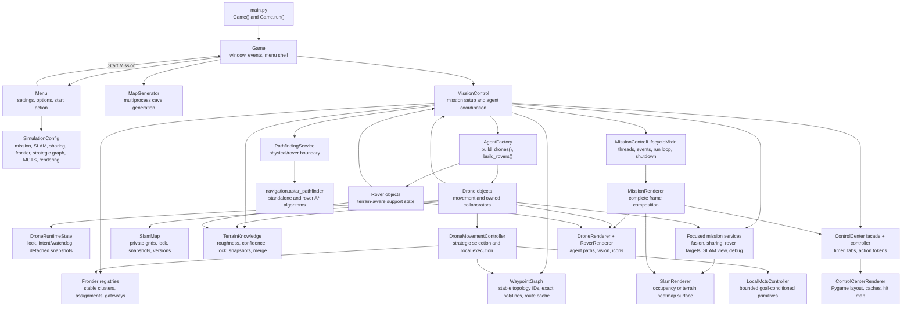

Core convention: map arrays are indexed as `map[y][x]`, while positions are
usually tuples of `(x, y)`. A cave cell value of `1` means wall and `0` means
floor.

## 2. Startup Call Stack

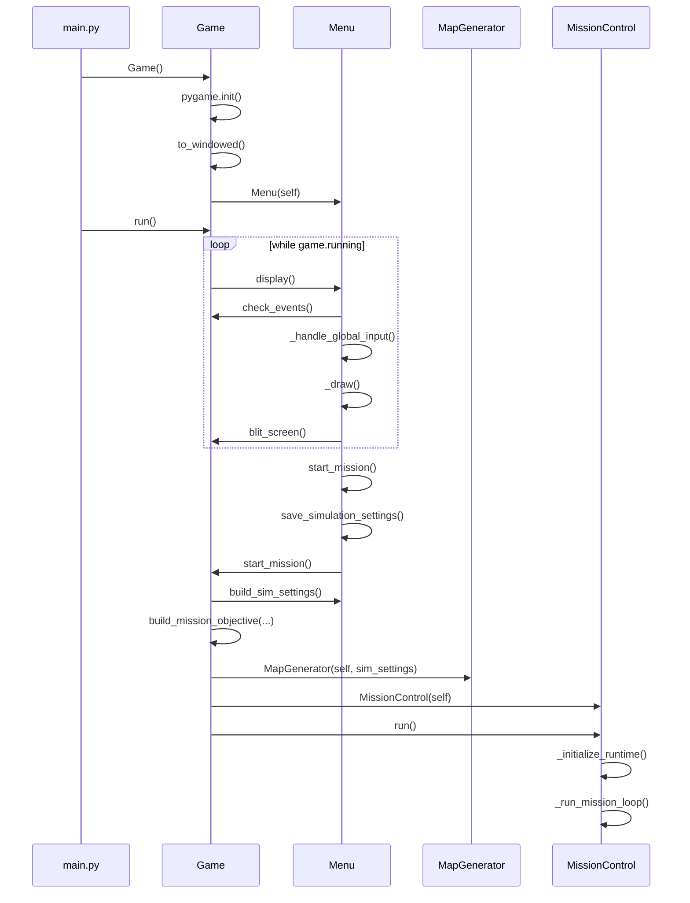

Entry point:

- `main.py`
  - imports `os`, `logging`, `pygame`, and `Game` from `game.py`
  - hides the Pygame support prompt with `PYGAME_HIDE_SUPPORT_PROMPT`
  - creates `Game()` and calls `game.run()`
  - owns process termination for unrecoverable startup/runtime errors

Primary startup classes:

- `Game`
  - `__init__(self) -> None`: initializes Pygame, sets window state, creates `Menu`.
  - `run(self) -> None`: repeatedly calls `self.menu.display()`.
  - `start_mission(self) -> None`: builds `SimulationConfig`, validates the selected objective, creates one `MapGenerator`, then constructs and runs fresh `MissionControl` instances while restart is requested.
  - `check_events(self) -> None`: converts Pygame events into key flags consumed by menus.
  - `blit_screen(self) -> None`: blits the internal display to the window and resets key flags.

- `Menu`
  - `display(self) -> None`: stable game-facing menu loop.
  - `build_sim_settings(self) -> SimulationConfig`: combines selected menu values with the immutable nested runtime configuration.
  - `start_mission(self) -> None`: saves settings and calls `Game.start_mission()`.
  - delegates navigation to `MenuController`, drawing to `MenuRenderer`,
    INI persistence to `MenuSettingsRepository`, and mixer operations to
    `MenuAudioService`.

## 3. Menu and Settings Flow

`Menu` is the facade used by `Game`. Typed row models describe each screen,
while focused collaborators own navigation, rendering, persistence, and audio.

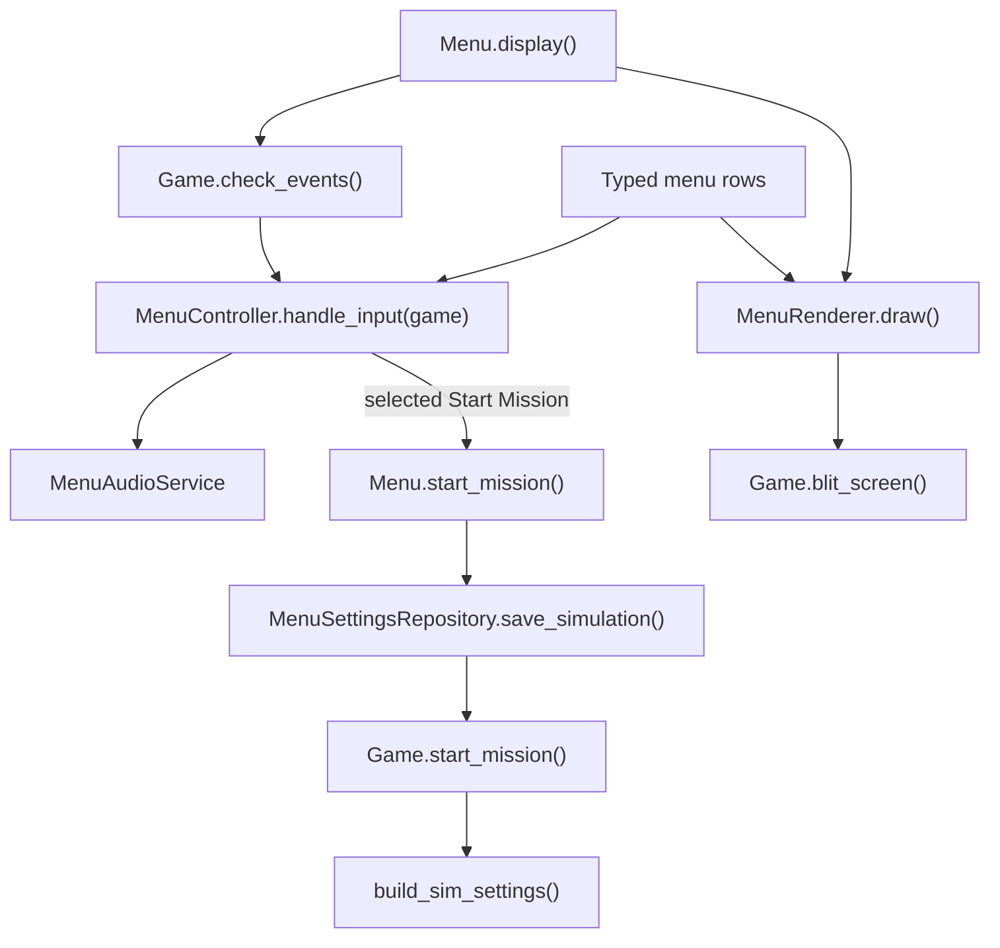

Important types and arguments:

- `TitleItem`, `ButtonItem`, `SelectorItem`, `TextInputItem`, `SliderItem`
  - typed definitions for menu rows.
- `MenuController`
  - owns active screen, selected row, navigation, named actions, and value
    changes. Both top-row and numpad digits enter seed values.
- `MenuRenderer`
  - owns menu backgrounds, fonts, layout, arrows, sliders, and loading-screen
    drawing.
- `MenuSettingsRepository`
  - writes ignored local settings and reads committed defaults.
- `MenuAudioService`
  - owns mixer initialization, music transitions, volume, and button sounds.
- `SimulationConfig`
  - immutable root containing `MissionConfig`, `SlamConfig`, `SharingConfig`,
    `FrontierConfig`, and `RenderingConfig`.

Libraries used here:

- `pygame` and `pygame.mixer`: rendering, input, fonts, audio.
- `configparser`: reads committed `GameConfig/*.default.ini` files and writes
  ignored `GameConfig/*.local.ini` files.
- `pathlib.Path` and `os`: asset and config paths.

## 4. Cave Generation Flow

`MapGenerator` is created before `MissionControl`; it builds the binary cave
map and roughness map that all later systems use.

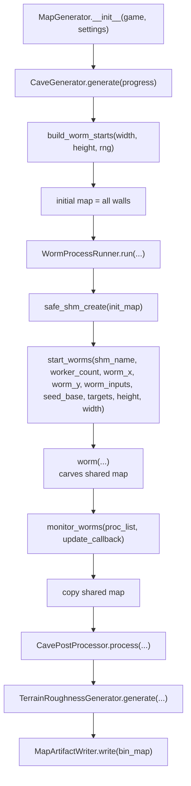

Key types:

- `MapGenerator.__init__(game, settings) -> None`
  - remains the runtime facade used by `Game`.
  - supplies loading callbacks, delegates generation, writes artifacts, and
    exposes `bin_map`, `terrain_roughness`, `worm_x`, and `worm_y`.

- `generation.CaveGenerator`
  - creates deterministic RNG state, derives `worm_inputs`, builds worm
    starts, runs workers, post-processes the cave, and returns a
    `CaveGenerationResult`.

- `generation.WormProcessRunner`
  - limits workers to `os.cpu_count()`, owns shared-memory create/copy/cleanup,
    starts workers, and monitors completion.

- `generation.CavePostProcessor`
  - applies median blur, removes isolated caves, preserves strong walls, and
    adds wall-transition noise when that pass succeeds.

- `generation.TerrainRoughnessGenerator`
  - creates a floor-only `float32` roughness map in `[0, 1]` from smooth noise,
    wall-distance bias, and clustered noise.

- `generation.MapArtifactWriter`
  - writes ignored runtime artifacts `map.png`, `map_matrix.txt`,
    `walls.png`, and `floor.png`.

Important helper functions in `generation/mapgen_helpers.py`:

- `safe_shm_create(init_map: np.ndarray)` -> shared memory object and ndarray view.
- `safe_shm_close(shm) -> None` -> closes and unlinks shared memory.
- `start_worms(shm_name, worker_count, worm_x, worm_y, worm_inputs, seed_base, targets, height, width) -> list[Process]`.
- `worm(shm_name, height, width, start_x, start_y, step, stren, life, wid, seed, worm_x_list, worm_y_list, targets_list) -> None`.
- `apply_cv_brush(sub, cx, cy, mode_choice, stren, rng=None) -> None`.
- `monitor_worms(proc_list, update_callback, poll_interval=0.05) -> bool`.
- `border_control_helper(...) -> int` and `homing_helper(...) -> int` steer carving direction.

Libraries used here:

- `numpy`: matrix storage, random generation, masks, normalization.
- `opencv-python` as `cv2`: blur, connected components, distance transform, image writes.
- `multiprocessing.Process` and `multiprocessing.shared_memory`: parallel cave carving.
- `pygame`: loading/saving map layers and loading screen updates.

## 5. Mission Setup

`MissionControl` is the central coordinator. It inherits
`MissionControlLifecycleMixin` for the mission loop, thread startup, and
shutdown, and directly owns its focused terrain, sharing, rover-target,
SLAM-view, and debug services.

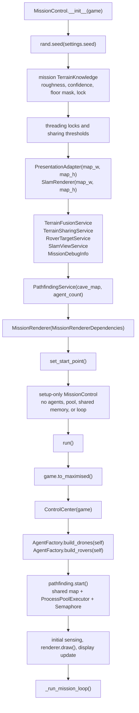

Important `MissionControl.__init__(game)` setup state:

- `self.map_matrix`: binary cave map from `game.cartographer.bin_map`.
- `self.terrain_roughness`: source roughness map from `MapGenerator`.
- `self.terrain_knowledge`: mission telemetry aggregate owning roughness, confidence, floor mask, and synchronization; active agent decisions must not read it.
- `self.pathfinding`: allocation-free `PathfindingService`; its worker pool and shared memory are created by `start()`.
- `self.presentation`: overlay state object.
- `self.slam_renderer`: cached surface renderer for occupancy/roughness.
- `self.*_dependencies`: small dependency bundles that expose only the
  collaborators each focused service or agent controller needs. `MissionControl`
  remains the composition root; dependencies use callables for live runtime
  state such as agents, the window, the control center, and simulation time.
- `self.terrain_fusion`, `self.terrain_sharing`, `self.rover_targets`,
  `self.slam_view`, `self.debug_info`: focused services constructed directly by
  mission setup from those dependency bundles.
- `self.frame_profiler`: smoothed main-loop and stage timing telemetry.
- `self.renderer`: scene-level `MissionRenderer`.
- `self.rover_motion_enabled = False`: rover movement code exists but rover threads are disabled by default in the current code.

`MissionControl.run()` initializes:

- maximized mission window and control center,
- drone and rover objects,
- pathfinding shared memory, process pool, and semaphore through `PathfindingService.start()`,
- initial sensor state and first rendered frame,
- agent worker threads and the blocking mission loop.

`AgentFactory` call path:

- `AgentFactory.build_drones(control) -> None`
  - sets `control.num_drones`.
  - loads/scales one drone icon.
  - creates `Drone(game, control, id, start_point, color, icon, map_matrix)` for each drone.

- `AgentFactory.build_rovers(control) -> None`
  - creates one first-aid rover plus one charging carrier per four drones.
  - therefore creates two rovers for three or four drones and three rovers
    for five through eight drones.
  - loads/scales one rover icon.
  - creates `Rover(game, control, id, start_point, color, icon, map_matrix)`.
  - rover construction creates its own `TerrainKnowledge`.

## 6. Mission Runtime Loop

The lifecycle mixin starts drone threads, optionally starts rover threads, and
keeps the main thread responsible for events, sensing, and drawing.

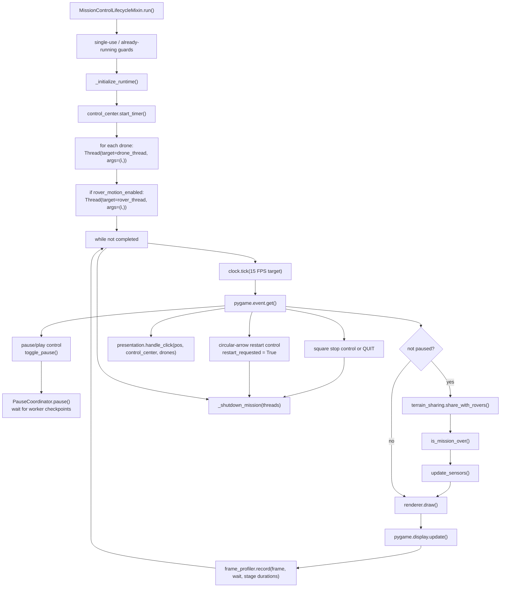

After shutdown, STOP and normal completion return to the windowed menu.
RESTART leaves the display in mission mode and returns control to
`Game.start_mission()`, which creates a fresh single-use `MissionControl`
against the existing `SimulationConfig` and `MapGenerator` result.

Key methods:

- `run(self) -> None`
  - rejects concurrent or repeated execution.
  - calls `_initialize_runtime()`.
  - creates `threading.Thread` objects for drones.
  - processes `QUIT`, stop-button clicks, and control-center clicks.
  - calls `terrain_sharing.share_with_rovers()`.
  - checks completion with `is_mission_over()`.
  - calls `update_sensors()` on the main thread.
  - draws and updates display.
  - always calls `_shutdown_mission(threads)` in `finally`.
  - restores the windowed view after shutdown.

- `is_mission_over(self) -> bool`
  - returns true only if every drone reports `mission_completed()` after the
    team coordinator confirms shared frontier exhaustion and coordinated
    homing.

- `_shutdown_mission(self, threads: list[threading.Thread]) -> None`
  - sets `mission_event`.
  - joins agent threads.
  - calls `PathfindingService.shutdown()` to release the process pool and shared memory.

Concurrency model:

- Main thread: Pygame event loop, sensor updates, rendering, global rover sharing.
- Drone threads: drone movement and drone-to-drone sharing.
- Optional rover threads: rover target acquisition and movement.
- Process pool workers: A* pathfinding using shared-memory map.

## 7. Drone Strategic Navigation Call Stack

Drone movement is driven by `MissionControl.drone_thread(drone_id)`, but the
planning inputs remain scoped to the requesting drone's detached runtime and
SLAM belief. `DroneMovementDependencies` contains the simulation clock, pause
callbacks, trace logger, and strategic graph; it contains no cave map or
mission A* callback.

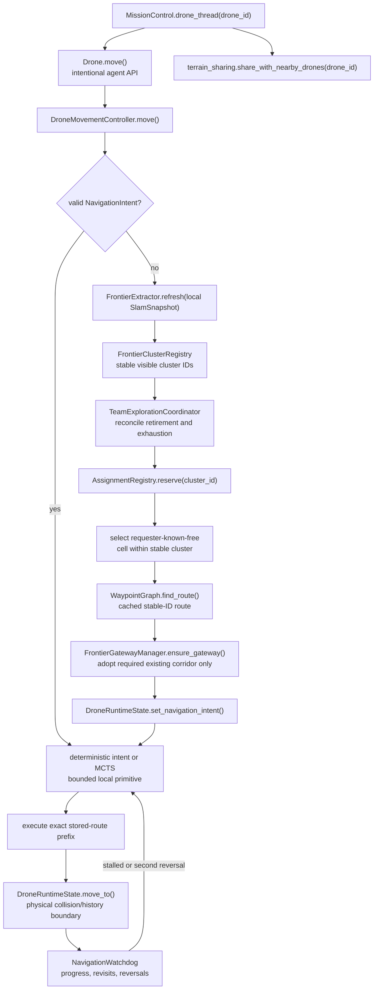

Important state and control boundaries:

- `DroneRuntimeState` atomically owns position, heading, physical history,
  stable frontier representatives, `MovementMode`, `NavigationIntent`, the
  navigation watchdog, transition reasons, sensor-ray endpoints, lifecycle,
  battery, and overlay visibility. Cross-thread readers receive detached
  `DroneSnapshot` values.
- `FrontierExtractor` derives confidently free/occupied and
  unknown-or-low-confidence masks from a `SlamSnapshot`. Generic discovery
  space must have at least the configured local unknown support, so isolated
  gaps between sampled rays do not become targets. An unknown cell adjacent to
  both confident free space and an observed occupied wall remains actionable
  as wall-surface continuation. Components carry separate `expected_gain`,
  `wall_gain`, and wall-adjacent free cells.
- `FrontierClusterRegistry` assigns monotonic cluster IDs, retains temporarily
  missing clusters, tombstones retired geometry, and limits visibility through
  each cluster's `known_by` set. `AssignmentRegistry` gives a reservation a
  stable token so two drones cannot own one cluster concurrently.
- `TeamExplorationCoordinator` reconciles the canonical registry into every
  runtime snapshot, releases retired reservations, invalidates stale intents,
  and starts every drone homing only after all drones report the team registry
  exhausted.
- A stable cluster keeps its canonical representative and ID, while each drone
  selects a waypoint from cluster cells confirmed free by that drone's SLAM.
  Wall-continuation cells with stronger nearby unknown support are preferred.
  A retained wall requires the configured minimum displacement (12 px by
  default); an unchanged closer tip is suppressed only for that drone until
  its canonical geometry changes. Global selection considers reachable,
  unreserved wall-continuation clusters first and falls back to coherent open
  unknown space only when that tier is empty.
- `FrontierGatewayManager` never creates a speculative protected node. It only
  adopts a corridor endpoint already required by connectivity repair, then
  retires orphan cluster corridor/gateway state when safe.
- `WaypointGraph` stores HOME, TURN, JUNCTION, CHOKEPOINT,
  FRONTIER_GATEWAY, and RECOVERY_ANCHOR nodes under monotonic IDs. One logical
  mutation commits one `GraphDelta` and topology revision. Travelled and
  requester-scoped belief-corridor edges retain their complete oriented
  polylines.
- `StrategicTrailAccumulator` keeps the current pose and uncommitted tail
  ephemeral. It promotes confirmed turns, travelled intersections,
  chokepoints, and coarse recovery anchors instead of fixed-spacing
  breadcrumbs.
- `WaypointGraph.find_route()` uses component rejection and a bounded LRU of
  multi-source reverse route trees keyed by the goal-connector set, topology
  revision, requester, and requester-scoped belief-edge validity. All visible
  goal connectors seed one exact Dijkstra traversal instead of rebuilding one
  tree per connector. Close non-LOS targets may use one 4 ms bounded
  known-free A* during route construction. Normal execution never reconstructs
  the route or invokes A* for a movement prefix.
- Graph maintenance retires orphan frontier corridors and roleless inactive
  travelled leaves, contracts only short *connected* inactive turn/junction
  edges, and batch-collapses safe inactive degree-two turn/junction nodes.
  Connected-node contraction joins the stored edge polylines through the
  retired position; spatial proximity alone never creates an edge. Active
  route IDs, HOME, CHOKEPOINT, RECOVERY_ANCHOR, and active FRONTIER_GATEWAY
  nodes are protected.
- `NavigationIntent` latches stable intent/route/cluster/gateway/assignment
  identity, route node and edge IDs, exact oriented segment paths, topology and
  knowledge revisions, edge/polyline cursors, scan heading count, sensor-local
  scan baselines, and remaining cost. Each tick advances only the physically
  executed distance and corresponding cursors.
- `FrontierExplorationPolicy` provides deterministic control on the same
  intent substrate. `MctsExplorationPolicy` changes only local execution: the
  exact `FOLLOW_EDGE` fast path remains deterministic, and a scan's sole
  `ROTATE_SCAN` action advances directly by 60 degrees without constructing an
  MCTS window. First-time regions retain the six-heading sweep; retained wall
  continuations center a configurable three-heading sweep on locally unknown
  wall-adjacent cells. Scan gain uses only the drone's sensor counters, so
  concurrent sharing cannot retain locally unproductive work. Recovery also
  follows its already-stored exact intent directly;
  belief preprocessing cannot change a single legal action. Only genuine
  competing local deviations use the bounded goal-conditioned
  `LocalMctsController`. A 40 ms decision gives
  28 ms to search and reserves 12 ms for scheduler margin, fallback, and
  diagnostics. Bounded SLAM-window acquisition is non-blocking; a busy sensor
  writer produces an immediate safe `preprocessing_lock` fallback instead of
  consuming the MCTS deadline while waiting for the map lock.
- `NavigationWatchdog` treats route-cost reduction or information gain as
  progress, records recent stable visits and A-B-A reversals, and transitions
  explicitly to RECOVERY after its thresholds.

The physical cave array remains in `Drone`/`DroneRuntimeState` only where the
simulator enforces collision and produces sensor truth. Planner-facing
contexts, movement dependencies, frontier extraction, route selection, and
local MCTS receive belief snapshots rather than the true cave topology.

## 8. Sensing, SLAM, and Terrain Sampling

Movement remains threaded, while sensing is an explicit main-thread update.
Sensing captures one runtime snapshot for its origin and heading. Rendering
consumes detached snapshots and does not mutate SLAM, terrain, or runtime
state.

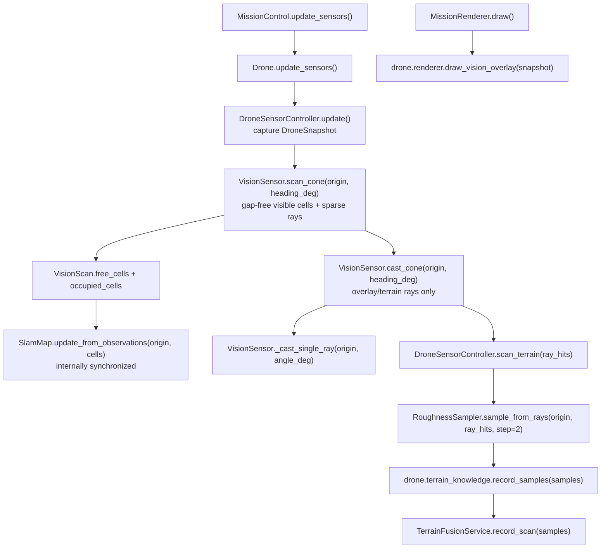

Important sensing types:

- `DroneSensorController.__init__(drone) -> None`
  - owns the `VisionSensor`, `RoughnessSampler`, scan interval, and scan timestamp.

- `DroneSensorController.update() -> None`
  - captures one coherent position/heading snapshot.
  - builds one dense visibility scan, stores its sparse endpoints through
    `DroneRuntimeState`, updates local SLAM from every visible cell, and
    triggers independent terrain sampling.

- `Drone.update_sensors() -> None`
  - delegates the simulation update to its sensor controller.

- `VisionSensor.__init__(map_matrix, fov_deg=60.0, num_rays=60, step=2) -> None`
  - prepares ray count, field of view, step size, and max range.

- `VisionSensor.cast_cone(origin, heading_deg) -> list[RayHit]`
  - casts `num_rays` across the field of view for presentation and terrain.

- `VisionSensor.scan_cone(origin, heading_deg) -> VisionScan`
  - rasterizes every cell inside the collision-bounded cone.
  - keeps free/occupied visibility separate from the sparse `ray_hits`.

- `VisionScan`
  - dataclass fields: `ray_hits`, `free_cells`, `occupied_cells`.

- `RayHit`
  - dataclass fields: `end`, `hit`, `distance`, `angle_deg`, `points`.

- `SlamMap.__init__(map_h, map_w, max_points=6000) -> None`
  - privately allocates occupancy, confidence, point-cloud, lock, and version
    state.

- `SlamMap.update_from_rays(origin, ray_hits) -> None`
  - remains the compatibility boundary for explicit ray observations.

- `SlamMap.update_from_observations(origin, free_cells, occupied_cells) -> bool`
  - marks every visible free cell from the dense scan.
  - marks every visible wall cell occupied and records wall points.
  - atomically advances the map version when owned state changes.

- `SlamMap.snapshot(point_limit=None) -> SlamSnapshot`
  - returns detached occupancy/confidence arrays, point data, and one atomic
    version.

- `RoughnessSampler.__init__(terrain_roughness, map_matrix) -> None`
  - stores source roughness and map geometry.

- `RoughnessSampler.sample_from_rays(origin, ray_hits, step=2) -> list[tuple[int, int, float, float]]`
  - samples roughness along visible floor cells.
  - returns `(x, y, roughness, confidence)` tuples.

- `DroneSensorController.scan_terrain(ray_hits) -> None`
  - throttles scans using `slam_scan_interval`.
  - calls `RoughnessSampler.sample_from_rays(..., step=2)`.
  - never feeds terrain confidence or roughness into SLAM exploration gain.
  - calls `drone.terrain_knowledge.record_samples(...)` for local knowledge.
  - delegates mission-global fusion to `TerrainFusionService`.

- `DroneRenderer.draw_vision_overlay(snapshot) -> None`
  - draws the detached ray endpoints and position from the supplied snapshot.
  - does not cast rays or update SLAM/terrain state.

## 9. Distributed Terrain and SLAM Sharing

Distributed terrain follows four ownership rules:

1. Drone decisions read that drone's local terrain and SLAM knowledge.
2. Mission terrain is an aggregate for rover routing and the optional terrain
   heatmap, not exploration progress and not an agent knowledge source.
3. Local knowledge moves between agents only through explicit sharing.
4. Rover target and route logic is disabled while rover motion is disabled;
   it must be converted to rover-local received knowledge before activation.

Mission control, every drone, and every rover own distinct `TerrainKnowledge`
instances. `TerrainSharingService` decides when transfers occur, while
`TerrainKnowledge` owns snapshots and the confidence-weighted merge rule.

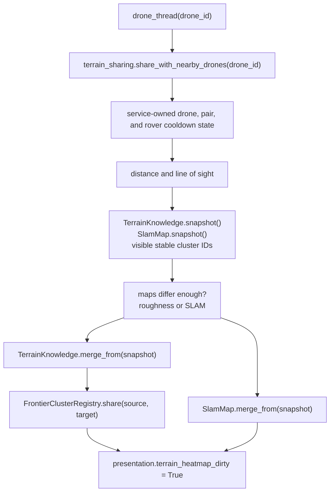

Key sharing methods:

- `TerrainSharingService.share_with_nearby_drones(drone_id) -> None`
  - owns and throttles per-drone and per-pair schedules.
  - atomically reserves pair processing so concurrent drone workers cannot
    exchange the same pair twice within one cooldown window.
  - checks distance against each drone radius.
  - checks line of sight through `has_line_of_sight(a, b)`.
  - compares local roughness/confidence via `maps_differ_enough(...)`.
  - compares SLAM occupancy/confidence via `slam_maps_differ_enough(...)`.
  - exchanges `TerrainSnapshot` values through `TerrainKnowledge.merge_from(...)`.
  - transfers stable cluster knowledge explicitly through
    `Drone.share_frontier_clusters_with(...)` / `FrontierClusterRegistry.share(...)`.
    It never merges raw frontier-coordinate lists.
  - exchanges occupancy belief through `SlamMap.merge_from(...)`.

- `TerrainSharingService.maps_differ_enough(source_roughness, source_confidence, target_roughness, target_confidence) -> bool`
  - samples maps using `share_compare_stride`.
  - returns true when the source adds enough new information or enough changed overlapping roughness.

- `TerrainSharingService.slam_maps_differ_enough(source_occ, source_conf, target_occ, target_conf) -> bool`
  - equivalent comparison for occupancy/confidence maps.

- `TerrainSharingService.share_with_rovers() -> None`
  - shares drone terrain to rovers when close enough and line-of-sight is clear.
  - is called from the main mission loop but only performs proximity checks and map snapshots when `rover_share_interval` has elapsed.
  - defaults to a 0.5-second interval even though rover motion is disabled by default.

- `TerrainFusionService.record_scan(samples) -> None`
  - records samples through mission-global `TerrainKnowledge`.
  - marks the heatmap dirty.
- `mapping.wall_mapping.wall_mapping_snapshot(...)`
  - combines occupied local SLAM evidence for telemetry only.
  - counts exposed wall pixels (outer cave, pillars, internal walls), excluding
    buried solid rock.
  - supplies `control_center.explored_percent`; it never enters a planner.

Merge rule summary:

- Roughness maps are confidence-weighted averages.
- Confidence values are capped at `1.0`.
- SLAM occupancy uses confidence dominance: higher-confidence source cells overwrite lower-confidence target cells.
- Cluster IDs are shared explicitly; each receiving drone still refreshes its
  component view from its own current SLAM state.

## 10. Strategic Routing and Physical Pathfinding Boundaries

Production drone planning uses `WaypointGraph` and requester-local SLAM, not
the cave-map-backed `PathfindingService`. Normal movement consumes the exact
stored route polyline at its persistent cursor. A bounded belief-only search
may be used when attaching the current pose or a required frontier corridor to
the strategic graph, or for a close non-LOS target during route construction;
persistent-edge and stored-connector prefixes perform zero A* calls.

`PathfindingService` still owns the lifecycle of the shared-memory physical
pathfinding resource and exposes a standalone cave-map algorithm API. The
disabled rover flow uses its terrain-weighted in-process route API. These are
simulator/rover boundaries and are not injected into `DroneMovementDependencies`.

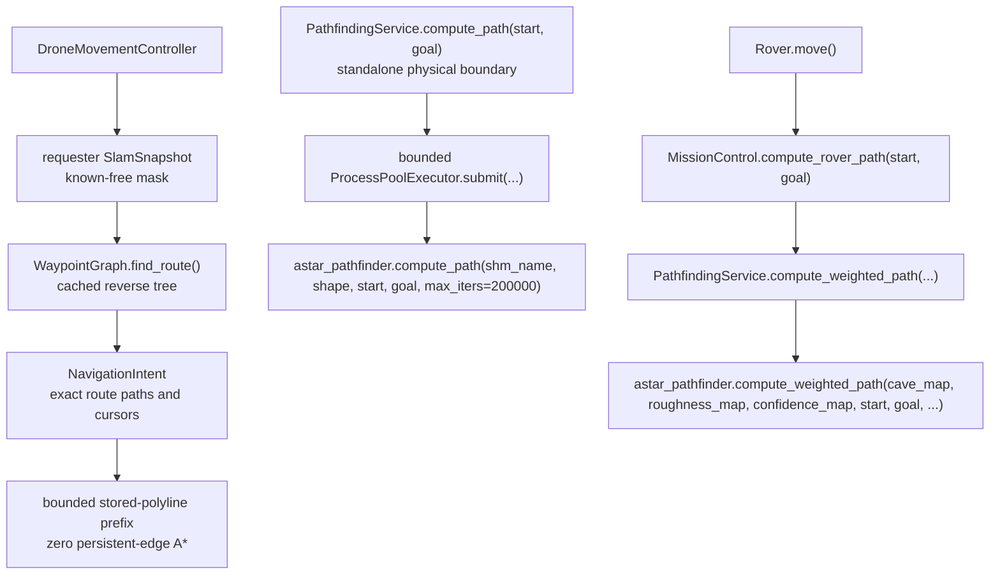

`PathfindingService(cave_map, agent_count)`

- `start()` copies the cave map into shared memory and creates a bounded worker pool.
- `compute_path(start, goal)` submits the standalone physical A* and blocks for
  its result; mission drone control has no forwarding method to it.
- `compute_weighted_path(roughness_map, confidence_map, start, goal)` delegates rover routing to the weighted algorithm.
- `shutdown()` idempotently closes the pool and closes/unlinks shared memory.
- Construction is allocation-free so `MissionControl.__init__()` remains setup-only.

`navigation.astar_pathfinder.compute_path(shm_name, shape, start, goal, max_iters=200000) -> list[tuple[int, int]]`

- Attaches to `multiprocessing.shared_memory.SharedMemory(name=shm_name)`.
- Treats `arr[y, x] == 0` as traversable.
- Uses 8-neighbor movement.
- Uses an octile-distance heuristic.
- Prevents tight diagonal corner cutting when both adjacent orthogonal cells are walls.
- Returns a path from start to goal, inclusive, or `[]`.
- Is covered as a physical grid algorithm, not used as a planner knowledge
  source by drones.

`navigation.astar_pathfinder.compute_weighted_path(cave_map, roughness_map, confidence_map, start, goal, max_iters=200000, roughness_weight=4.0, unknown_penalty=2.5, low_confidence_penalty=1.5) -> list[tuple[int, int]]`

- Uses the same 8-neighbor A* structure.
- Adds cost for unknown cells.
- Adds cost for rough cells.
- Adds cost for low-confidence terrain observations.
- Used by rovers through `MissionControl.compute_rover_path(start, goal)`.

## 11. Rover Flow

Rover movement is present but disabled by default because
`MissionControl.rover_motion_enabled` is currently set to `False`.
The current target selection and weighted routing read mission telemetry and
are retained only as disabled rover-motion scaffolding. They are not the final
distributed rover semantics and must not be enabled unchanged.

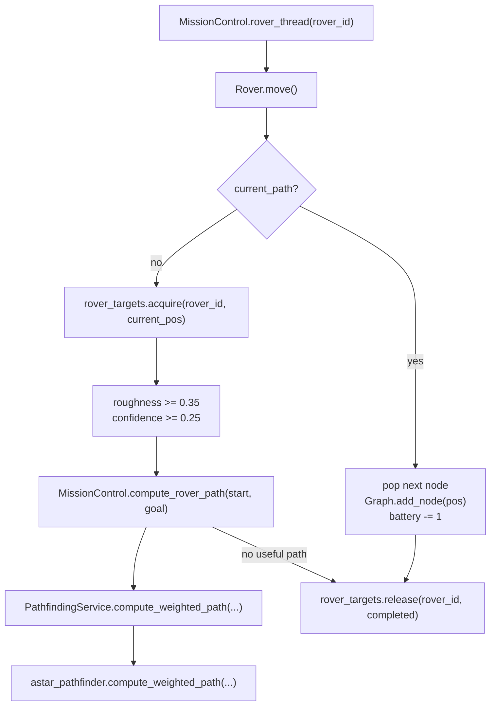

Important methods:

- `Rover.__init__(game, control, id, start_pos, color, icon, cave) -> None`
  - stores mission settings, draw state, battery, path history, target, graph.

- `Rover.move(self) -> None`
  - if `current_path` exists, advances one point and drains battery.
  - otherwise asks the controller for a target and terrain-aware path.

- `RoverTargetService.acquire(rover_id, current_pos) -> tuple[int, int] | None`
  - finds rough, known floor cells.
  - excludes assigned and completed targets.
  - scores by roughness, confidence, and distance.

- `RoverTargetService.release(rover_id, completed=False) -> None`
  - releases assignment and optionally marks target complete.

## 12. Rendering and UI Flow

`MissionRenderer.draw()` owns the main visual layering. It always starts with
a black canvas and a SLAM/terrain surface rather than the ground-truth cave
image. Agent-specific Pygame operations are delegated directly to renderer
objects.

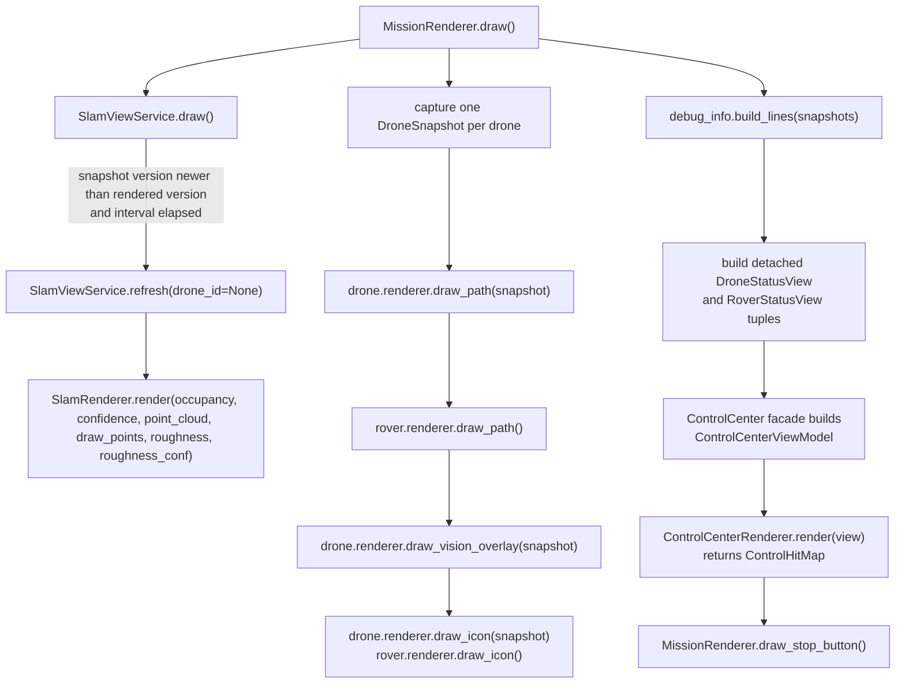

Overlay state and click flow:

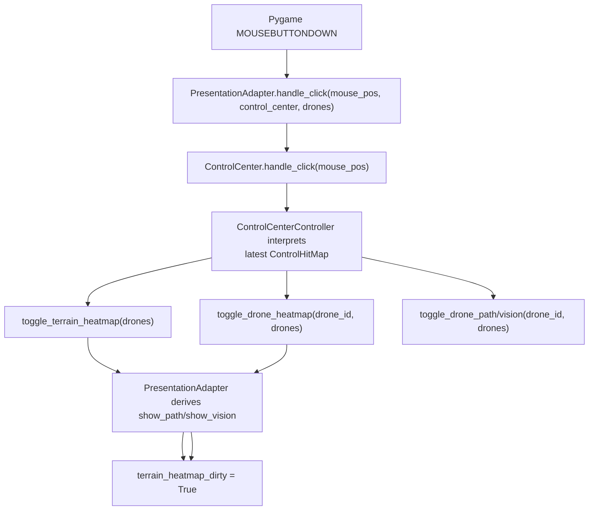

Important UI classes:

- `PresentationAdapter(map_w, map_h)`
  - stores `show_terrain_heatmap`, `selected_drone_heatmap_id`, and `terrain_heatmap_dirty`.
  - solely owns heatmap selection and path/vision visibility transitions.
  - resets presentation state when runtime agents are created.
  - routes action tokens from the hit-testing-only `ControlCenter.handle_click(...)`.

- `ControlCenter(game)`
  - is the mission-facing facade.
  - delegates timer, progress, tab selection, and hit interpretation to
    `ControlCenterController`.
  - builds one immutable `ControlCenterViewModel` per frame.
  - retains the latest detached `ControlHitMap` returned by the renderer.
  - receives detached drone and rover status tuples each frame.
  - derives deployed counts from those tuples while retaining named
    undeployed roster slots as `N/A`.

- `ControlCenterController`
  - owns elapsed mission time, pause accounting, explored percentage, active
    tab, and conversion of hit rectangles into existing action tokens.
  - contains no Pygame surfaces, fonts, images, or drawing code.

- `ControlCenterViewModel`, `DroneStatusView`, and `RoverStatusView`
  - are immutable values copied from current runtime agents by
    `MissionRenderer`.
  - carry complete per-frame display data without exposing mutable agents or
    controller state to the renderer.

- `ControlHitMap`
  - is an immutable set of plain rectangle tuples produced by layout.
  - crosses from the renderer to the controller without exposing renderer
    caches or surfaces.

- `ControlCenterRenderer`
  - owns control-panel geometry, Pygame surfaces, fonts, image resources,
    static/dynamic caches, text composition, drawing, and layout.
  - consumes only `ControlCenterViewModel` and returns `ControlHitMap`; it does
    not call back into `ControlCenter`.

- `SlamRenderer(map_w, map_h)`
  - owns a Pygame surface.
  - renders either occupancy/confidence or terrain roughness/confidence.

- `MissionRenderer(MissionRendererDependencies)`
  - owns complete frame composition and the stop-button rectangle/visual.
  - captures each drone once per frame and supplies that same snapshot to
    path, vision, icon, debug, and control-center consumers.
  - delegates map, agent, debug, and control-center layers to focused collaborators.
  - receives live mission objects through narrow callables supplied by
    `MissionControl`.

- `DroneRenderer(drone)` and `RoverRenderer(rover)`
  - own agent-specific Pygame surfaces.
  - draw paths, vision overlays, and centered agent icons.
  - read agent state without owning movement, sensing, or sharing logic.

## 13. Library and Module Dependency Map

External and standard libraries by responsibility:

- Pygame: window, display surfaces, fonts, input, image loading/saving, audio.
- NumPy: cave arrays, masks, confidence maps, roughness maps, shared-memory array views.
- OpenCV (`cv2`): map smoothing, connected components, distance transform, image writes.
- `multiprocessing` and `multiprocessing.shared_memory`: map generation workers and A* shared map.
- `concurrent.futures.ProcessPoolExecutor`: drone A* worker pool.
- `threading`: drone/rover threads, locks, mission stop event, semaphore.
- `heapq`: A* open set.
- `math`: distances, angles, heuristics, trigonometry.
- `random`: drone direction choice, agent colors, mission seed.
- `configparser`: menu settings persistence.
- `dataclasses`: immutable simulation configuration, `POI`, `RayHit`, and UI
  state holders.
- `pathlib.Path` and `os`: resource and config paths.
- `logging`: non-fatal diagnostics.

Internal package and class relationships:

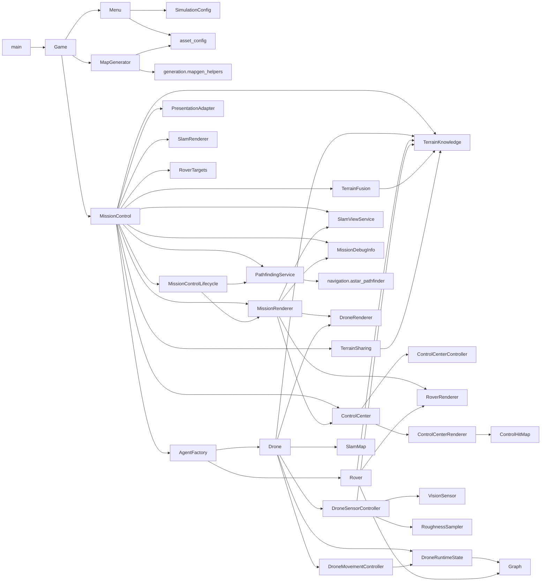

## 14. Module Reference

### `main.py`

- Libraries: `os`; internal `Game`.
- Calls: `Game()`, `Game.run()`.
- Use it as the executable entry point.

### `game.py`

- Libraries: `os`, `logging`, `pygame`.
- Internal imports: `asset_config.gameplay.Display`,
  `asset_config.media.Images`, `generation.map_generator.MapGenerator`,
  `mission.control.MissionControl`, `mission.objectives`, and
  `ui.menu.facade.Menu`.
- Class: `Game`
  - `__init__(self)`: initializes Pygame, key flags, window, and menu.
  - `run(self)`: menu loop.
  - `start_mission(self)`: creates settings, map generator, and mission controller.
  - `check_events(self)`: maps Pygame events to `UP_KEY`, `DOWN_KEY`, `START_KEY`, `BACK_KEY`, `LEFT_KEY`, `RIGHT_KEY`.
  - `reset_keys(self)`, `blit_screen(self)`, `_setup_window(self, width, height)`, `to_maximised(self)`, `to_windowed(self)`.

### `ui/menu/facade.py`

- Class: `Menu`.
- Stable facade used by `Game`; creates typed screens, coordinates focused
  collaborators, builds `SimulationConfig`, and starts missions.
- Main methods:
  - `Menu.display()`, `_handle_global_input()`, `_draw()`, `build_sim_settings()`, `start_mission()`.

### Menu collaborators

- `ui/menu/models.py`: typed screen, action, title, button, selector, text-input,
  and slider models.
- `ui/menu/controller.py`: navigation, input transitions, selection, and named
  action dispatch.
- `ui/menu/renderer.py`: Pygame resources and all menu/loading-screen drawing.
- `ui/menu/settings_repository.py`: audio persistence and current
  simulation-format serialization.
- `ui/menu/audio_service.py`: mixer resources and audio preference application.

### `config/simulation_config.py`

- `SimulationConfig` is the immutable validated runtime model passed from
  `Menu` to `MapGenerator` and `MissionControl`.
- Nested sections own mission, SLAM, sharing, frontier, and rendering values.

### `generation/map_generator.py`

- Libraries: `logging`, `pygame`.
- Internal imports: display/config constants and generation services.
- Class: `MapGenerator`
  - `__init__(game, settings)`: delegates map generation and artifact output,
    then exposes the mission-facing generated data.

### `generation/`

- `cave_generator.py`: `CaveGenerator`, `CaveGenerationResult`,
  `CaveGenerationProgress`, and deterministic worm-start creation.
- `worm_process_runner.py`: shared-memory allocation, worm process startup,
  monitoring, copied result creation, and cleanup.
- `cave_post_processor.py`: OpenCV cleanup and wall-transition noise.
- `terrain_roughness_generator.py`: floor-only roughness synthesis.
- `map_artifact_writer.py`: generated image, layer, matrix persistence, and
  `image_path_from_key(key)` resolution.

### `generation/mapgen_helpers.py`

- Libraries: `math`, `logging`, `contextmanager`, `time`, `multiprocessing.Process`, `multiprocessing.shared_memory`, `numpy`, `cv2`, `pygame`.
- Internal imports: `next_cell_coords`, `MapGen`.
- Functions:
  - `with_surfarrays(surface)`
  - `apply_cv_brush(sub, cx, cy, mode_choice, stren, rng=None)`
  - `remove_hermit_caves(image)`
  - `add_wall_transition_noise(image, width, height, seed, worm_inputs)`
  - `safe_shm_create(init_map)`
  - `safe_shm_close(shm)`
  - `worm(shm_name, height, width, start_x, start_y, step, stren, life, wid, seed, worm_x_list, worm_y_list, targets_list)`
  - `start_worms(shm_name, worker_count, worm_x, worm_y, worm_inputs, seed_base, targets, height, width)`
  - `monitor_worms(proc_list, update_callback, poll_interval=0.05)`
  - `border_control_helper(...)`
  - `homing_helper(rng, x, y, target_x, target_y)`
  - `make_derangement(n, rng)`

### `mission/control.py`

- Libraries: `random`, `threading`, `typing`, `numpy`, `pygame`.
- Internal imports: `asset_config.helpers.wall_hit`,
  `agents.factory.AgentFactory`, `ui.control_center.facade.ControlCenter`,
  `mapping.terrain_knowledge.TerrainKnowledge`, the focused mission services,
  `navigation.pathfinding.PathfindingService`,
  `mission.presentation_adapter.PresentationAdapter`,
  `rendering.slam_renderer.SlamRenderer`,
  `rendering.mission_renderer.MissionRenderer`, and the lifecycle mixin.
- Class: `MissionControl(MissionControlLifecycleMixin)`
  - `__init__(game)`: setup-only mission state construction.
  - `_initialize_runtime()`: window, control center, agents, resources, and first frame.
  - `set_start_point()`: picks a floor cell from worm starts.
  - `drone_thread(drone_id)`: moves one drone and triggers nearby sharing.
  - `compute_rover_path(start, goal)`: copies terrain state and delegates weighted routing.
  - `rover_thread(rover_id)`.
  - `update_sensors()`.

### `mission/lifecycle.py`

- Libraries: `threading`, `time`, `typing.List`, `pygame`.
- Class: `MissionControlLifecycleMixin`
  - `is_mission_over()`
  - `_shutdown_mission(threads)`
  - `_start_agent_threads()`
  - `_run_mission_loop()`
  - `run()`
- The main loop records frame wait, events, sharing, mission-status, sensing,
  rendering, and display durations through `FrameProfiler`.
- The square control completes the run normally. The circular-arrow control sets `restart_requested`, completes
  the run, performs normal worker/resource cleanup, and skips the intermediate
  windowed-menu transition.
- The pause/play control closes a worker barrier, waits for every registered
  agent thread to reach a movement/sharing checkpoint, and skips main-thread
  sharing, completion, and sensor updates while rendering and events continue.
- `SimulationClock` removes paused wall time from sensing, sharing, frontier,
  and progress-update cooldowns.

### `mission/objectives.py`

- Class/protocol: `MissionObjective`.
- Implemented objective: `ExplorationObjective`.
- Factory: `build_mission_objective(objective_index)`.
- Search and Rescue remains planned; selecting it fails fast instead of
  silently using exploration completion rules.

### `mapping/terrain_knowledge.py`

- Libraries: `threading`, `dataclasses`, `typing`, `numpy`.
- Dataclass: `TerrainSnapshot(roughness, confidence)`.
- Function: `fuse_terrain_samples(roughness, confidence, cave_map, samples)`.
- Class: `TerrainKnowledge`
  - `record_samples(samples)`
  - `snapshot()`
  - `merge_from(snapshot)`
  - `known_mask(threshold=0.0)`
  - `explored_ratio(threshold=0.0)`
- Owns terrain arrays, floor masking, synchronization, snapshot isolation, observation fusion, and confidence-weighted merging.

### `contracts.py`

- Libraries: `dataclasses`, `typing`, `numpy`.
- Dataclasses:
  - `TerrainFusionDependencies`
  - `TerrainSharingDependencies`
  - `RoverTargetDependencies`
  - `SlamViewDependencies`
  - `MissionDebugDependencies`
  - `MissionRendererDependencies`
  - `DroneMovementDependencies`
  - `DroneSensorDependencies`
  - `RoverNavigationDependencies`
- Protocols describe the minimum mission-facing display, presentation, terrain,
  and SLAM-renderer APIs.
- Keeps `MissionControl` as the only broad composition root while allowing
  terrain, sharing, rendering, movement, sensing, and rover navigation
  collaborators to receive narrow, explicit inputs without importing
  `mission`.

### `mapping/terrain_fusion.py`

- Libraries: `typing`.
- Internal imports: `TerrainKnowledge` helpers and `TerrainFusionDependencies`.
- Class: `TerrainFusionService`
  - `record_scan(samples)`
- Records samples into mission `TerrainKnowledge` for telemetry and combined
  rendering without transferring or mutating agent-local knowledge.

### `agents/drone_movement.py`

- Libraries: `math`, `random`, `time`, `typing`, `numpy`.
- Internal imports: `FREE`, `next_cell_coords`.
- Class: `DroneMovementController`
  - `move()`
  - `reach_start_point()`
  - `find_new_node()`
  - `explore(valid_dirs, valid_targets, chosen_target)`
  - `reach_border()`
  - `update_borders()`, `maybe_rebuild_frontiers()`, `rebuild_frontiers(...)`
  - `mission_completed()`
  - `get_distance(target)`
- Owns exploration policy, retry bookkeeping, A* traversal, and homing
  decisions while delegating shared mutation to `DroneRuntimeState`.
- Receives pathfinding, pause, and simulation-time callbacks through
  `DroneMovementDependencies`; it does not retain the whole mission control.

### `agents/drone_runtime_state.py`

- Libraries: `dataclasses`, `math`, `threading`, `typing`.
- Dataclass: `DroneSnapshot`.
- Class: `DroneRuntimeState`
  - `snapshot()`
  - `move_to(position)`
  - `graph_is_valid(current, candidate)`
  - frontier merge/replace/remove operations
  - lifecycle, sensor-ray, battery, and overlay mutation methods
  - `reserve_frontier_rebuild(now)`
- Owns synchronized drone runtime mutation, the private `Graph`, immutable
  snapshot creation, and atomic position/heading/path-history updates.

### `mapping/drone_sensor.py`

- Libraries: `typing`, `numpy`.
- Internal imports: `RoughnessSampler`, `VisionSensor`, `TerrainSample`,
  `DroneSensorDependencies`.
- Class: `DroneSensorController`
  - `update()`
  - `scan_terrain(ray_hits)`
  - `record_local_scan(samples)`
- Owns ray casting, local SLAM updates, and local/global terrain sampling
  using one captured runtime origin per update.
- Receives terrain source data, simulation time, and the mission telemetry
  recording callback through `DroneSensorDependencies`.

### `mapping/terrain_sharing.py`

- Libraries: `math`, `threading`, `typing`, `numpy`.
- Internal imports: `TerrainSharingDependencies`.
- Class: `TerrainSharingService`
  - `has_line_of_sight(a, b)`
  - `maps_differ_enough(...)`
  - `slam_maps_differ_enough(...)`
  - `share_with_nearby_drones(drone_id)`
  - `share_with_rovers()`
- Owns proximity, synchronized drone/pair/rover cooldown state, terrain
  sharing, and SLAM sharing rules.
- Reads drone positions and frontiers only from detached runtime snapshots.
- Rover sharing defaults to a 0.5-second cooldown so full terrain snapshots
  are not copied every frame.

### `mapping/rover_targets.py`

- Libraries: `math`, `typing`, `numpy`.
- Class: `RoverTargetService`
  - `acquire(rover_id, current_pos)`
  - `release(rover_id, completed=False)`
- Owns target scoring and reservation for rough terrain rover goals.
- Receives cave, mission terrain telemetry, and assignment state through
  `RoverTargetDependencies`.

### `rendering/slam_view.py`

- Libraries: `time`, `typing`, `numpy`.
- Internal imports: `SlamViewDependencies`.
- Class: `SlamViewService`
  - `refresh(drone_id=None)`
  - `draw()`
- Owns combined/per-drone SLAM and terrain heatmap surface orchestration.
- Tracks the last rendered `SlamSnapshot.version` per drone.
- Rebuilds cached surfaces only after a relevant map version changes and
  `slam_render_interval` has elapsed; the cached surface is still blitted
  every frame.

### `rendering/mission_renderer.py`

- Libraries: `math`, `pygame`.
- Internal imports: `Colors`, `MissionRendererDependencies`, and detached
  control-center status builders.
- Class: `MissionRenderer`
  - `draw()`
  - `draw_stop_button()`
  - `draw_restart_button()`
  - `draw_pause_button()`
- Owns complete mission frame order and the compact stop/restart/pause icon
  controls.
- Copies live agent data into detached status views before drawing the control
  center.

### `ui/control_center/view_model.py`

- Libraries: `dataclasses`, `typing`.
- Dataclasses: `AgentRosterEntry`, `DroneStatusView`, `RoverStatusView`.
- Functions:
  - `build_drone_status_views(drones)`
  - `build_rover_status_views(rovers)`
- Owns the stable Blinky-through-Kinky and Huey-through-Louie presentation
  identities and creates immutable per-frame status values.

### `rendering/agent_renderer.py`

- Libraries: `typing`, `pygame`.
- Internal import: `Colors`.
- Classes:
  - `DroneRenderer`: owns path, vision, and start-marker surfaces; draws drone
    path, vision, and icon from one supplied `DroneSnapshot`.
  - `RoverRenderer`: owns the rover path surface; draws rover path and icon.

### `mission/debug_info.py`

- Libraries: `typing`.
- Internal imports: `MissionDebugDependencies`.
- Class: `MissionDebugInfo`
  - `build_lines()`
- Owns the debug text shown in the control center.
- Adds smoothed frame rate, work/wait split, and high-cost stage timings when
  profiler samples are available.

### `mission/frame_timing.py`

- Libraries: `dataclasses`, `typing`.
- Dataclass: `FrameTimingSnapshot`.
- Class: `FrameProfiler`
  - `record(frame_seconds, wait_seconds, stages)`
  - `snapshot()`
- Owns exponentially smoothed frame-loop telemetry independently from mission
  orchestration and rendering.

### `agents/factory.py`

- Libraries: `math`, `random`, `typing.Tuple`, `pygame`.
- Internal imports: game options, media paths, colors, `Drone`, `Rover`.
- Class: `AgentFactory`
  - `build_drones(control) -> None`
  - `build_rovers(control) -> None`
  - `get_rover_count(num_drones) -> int`
  - `choose_rover_color(rover_colors) -> tuple[int, int, int]`
  - `get_drone_icon_dim(map_dim) -> tuple[int, int]`
  - `get_rover_icon_dim(map_dim) -> tuple[int, int]`

### `agents/drone.py`

- Libraries: `random`, `typing`.
- Internal imports: `DroneRuntimeState`, `SlamMap`, `TerrainKnowledge`,
  `DroneMovementController`, `DroneSensorController`, `DroneRenderer`, and
  drone dependency bundles.
- Class: `Drone`
  - Intentional mission API: `move()`, `mission_completed()`,
    `update_sensors()`, `snapshot()`.
  - Sharing API: `merge_frontiers(other_border)`.
  - Presentation state: `toggle_path()`, `toggle_vision()`,
    `set_overlay_visibility(...)`.
  - Detailed movement, sensing, terrain, SLAM, and rendering work is accessed
    through its owned collaborators rather than mirrored wrappers.
  - Receives the mission collaborators needed by movement and sensing.

### `agents/rover.py`

- Libraries: `random`, `typing`.
- Internal imports: `Graph`, `TerrainKnowledge`, `RoverRenderer`,
  `RoverNavigationDependencies`.
- Class: `Rover`
  - `__init__(game, control, id, start_pos, color, icon, cave)`
  - `calculate_radius()`
  - `move()`
  - owns `terrain_knowledge` and `renderer` directly without mirrored
    array/surface properties.
  - Uses `RoverNavigationDependencies` for target acquisition/release and
    rover pathfinding instead of retaining the whole mission control.

### `navigation/pathfinding.py`

- Libraries: `logging`, `os`, `threading`, `concurrent.futures.ProcessPoolExecutor`, `multiprocessing.shared_memory`, `typing`, `numpy`.
- Internal import: `navigation.astar_pathfinder`.
- Class: `PathfindingService`
  - `start()`
  - `compute_path(start, goal)`
  - `compute_weighted_path(roughness_map, confidence_map, start, goal)`
  - `shutdown()`
- Owns the mission pathfinding shared map, worker pool, submission semaphore, and rover algorithm delegation.

### `navigation/astar_pathfinder.py`

- Libraries: `heapq`, `math`, `typing`, `numpy`, `multiprocessing.shared_memory`.
- Functions:
  - `compute_path(shm_name, shape, start, goal, max_iters=200000)`
  - `compute_weighted_path(cave_map, roughness_map, confidence_map, start, goal, max_iters=200000, roughness_weight=4.0, unknown_penalty=2.5, low_confidence_penalty=1.5)`

### `agents/graph.py`

- Libraries: `typing`.
- Internal import: `wall_hit`.
- Class: `Graph`
  - `__init__(x_start, y_start, cave_mat)`
  - `add_node(pos)`
  - `is_valid(curr_pos, candidate_pos)`
  - `cross_obs(x1, y1, x2, y2)`

### `mapping/vision_sensor.py`

- Libraries: `dataclasses.dataclass`, `typing`, `math`, `numpy`.
- Internal import: `wall_hit`.
- Classes:
  - `RayHit(end, hit, distance, angle_deg, points)`
  - `VisionScan(ray_hits, free_cells, occupied_cells)`
  - `VisionSensor(map_matrix, fov_deg=60.0, num_rays=60, step=2)`
- Methods:
  - `scan_cone(origin, heading_deg)`
  - `cast_cone(origin, heading_deg)`
  - `_cast_single_ray(origin, angle_deg)`

### `mapping/slam_map.py`

- Libraries: `collections.deque`, `dataclasses`, `itertools.islice`,
  `threading`, `typing`, `math`, `numpy`.
- Constants: `UNKNOWN = -1`, `FREE = 0`, `OCCUPIED = 1`.
- Dataclass: `SlamSnapshot(occupancy, confidence, point_cloud, version)`.
- Class: `SlamMap`
  - `__init__(map_h, map_w, max_points=6000)`
  - `snapshot(point_limit=None)`
  - `has_changed_since(version)`
  - `update_from_rays(origin, ray_hits)`
  - `update_from_observations(origin, free_cells, occupied_cells)`
  - `merge_from(snapshot)`
- Owns synchronization, private arrays, bounded point storage,
  confidence-dominant merging, detached snapshots, and version advancement.

### `rendering/slam_renderer.py`

- Libraries: `typing`, `numpy`, `pygame`.
- Internal imports: `FREE`, `OCCUPIED`.
- Class: `SlamRenderer`
  - `__init__(map_w, map_h)`
  - `render(occupancy, confidence, point_cloud=None, draw_points=True, roughness=None, roughness_conf=None)`

### `mapping/roughness_sampler.py`

- Libraries: `typing`, `math`, `numpy`.
- Class: `RoughnessSampler`
  - `__init__(terrain_roughness, map_matrix)`
  - `sample_from_rays(origin, ray_hits, step=2)`

### `mission/presentation_adapter.py`

- Libraries: `typing`, `pygame`.
- Class: `PresentationAdapter`
  - `__init__(map_w, map_h)`
  - `reset(drone_objects)`
  - `toggle_terrain_heatmap(drone_objects)`
  - `toggle_drone_heatmap(drone_id, drone_objects)`
  - `toggle_drone_path(drone_id, drone_objects)`
  - `toggle_drone_vision(drone_id, drone_objects)`
  - `handle_click(mouse_pos, control_center, drone_objects)`

### `ui/control_center/facade.py`

- Libraries: `typing`.
- Internal imports: `ControlCenterController`, `ControlHitMap`,
  `ControlCenterRenderer`, and detached view models.
- Class: `ControlCenter`.
- Main methods:
  - `draw_control_center(...)`
  - `handle_click(mouse_pos)`
  - `start_timer()`, `pause_timer()`, `resume_timer()`, `format_timer()`
  - `set_explored_percent(value)`
- Provides the stable mission-facing facade without owning Pygame resources.

### `ui/control_center/controller.py`

- Libraries: `dataclasses`, `time`, `typing`, `pygame`.
- Dataclass: `ControlHitMap`.
- Class: `ControlCenterController`
  - timer start/pause/resume/format operations
  - explored-progress and active-tab state
  - `handle_click(mouse_pos, hit_map)`
- Owns non-rendering state and preserves all existing presentation action
  tokens.

### `ui/control_center/renderer.py`

- Libraries: `pathlib`, `time`, `typing`, `pygame`.
- Internal imports: display/media/rendering resources, immutable frame models,
  and `ControlHitMap`.
- Class: `ControlCenterRenderer`
  - `render(view_model) -> ControlHitMap`
  - owns the control surface, layout constants, cache state, and top-level
    frame flow.
- Helper mixins:
  - `ui/control_center/panels.py`: tab contents and agent status rows.
  - `ui/control_center/widgets.py`: tabs, toggles, icons, and hit rectangles.
  - `ui/control_center/text_helpers.py`: font caching, text wrapping, and
    composed status surfaces.

### `mapping/poi.py`

- Libraries: `dataclasses`, `typing`.
- Class: `POI`
  - data holder for points of interest.
  - implements `__hash__` and `__eq__`.
- This module is present but not part of the current main runtime call stack.

### `asset_config/`

- `gameplay.py`: `Display`, `GameOptions`.
- `mapgen.py`: `MapGen`, `WormInputs`.
- `media.py`: `Audio`, `Images`.
- `rendering.py`: `Colors`, `DroneColors`, `RoverColors`, `Fonts`, `RectHandle`.
- `helpers.py`: `next_cell_coords(x, y, step_len, direction)`, `wall_hit(map_matrix, pos)`.

## 15. New Developer Reading Order

1. Start with `main.py`, `game.py`, and `ui/menu/facade.py` to understand launch and configuration.
2. Read `config/simulation_config.py`, `ui/menu/settings_repository.py`, and
   `asset_config/` to understand runtime configuration and persistence.
3. Read `generation/map_generator.py` and `generation/`, then skim `generation/mapgen_helpers.py` for
   the multiprocessing worker entrypoint and low-level map helpers.
4. Read `mission/control.py`, `mission/objectives.py`, then `mission/lifecycle.py`.
5. Read the focused services: `mapping/terrain_knowledge.py`,
   `agents/drone_runtime_state.py`, `agents/drone_movement.py`,
   `navigation/pathfinding.py`, `mapping/drone_sensor.py`,
   `mapping/terrain_fusion.py`, `mapping/terrain_sharing.py`,
   `mapping/rover_targets.py`, `rendering/mission_renderer.py`,
   `rendering/slam_view.py`, `rendering/agent_renderer.py`,
   `mission/debug_info.py`, and `mission/frame_timing.py`.
6. Read `agents/drone.py` with `agents/drone_runtime_state.py`, `agents/graph.py`,
   `mapping/vision_sensor.py`, `mapping/slam_map.py`, and `mapping/roughness_sampler.py` open beside it.
7. Read `navigation/astar_pathfinder.py` after `navigation/pathfinding.py` when you need the algorithm details.
8. Read `mission/presentation_adapter.py`, `ui/control_center/facade.py`, `ui/control_center/renderer.py`, and `rendering/slam_renderer.py` to understand interaction and visualization.
9. Read `agents/rover.py` last; its motion code is built, but rover threads are currently off by default.

## 16. Practical Notes and Gotchas

- `MissionControl.__init__()` is setup-only. `Game.start_mission()` explicitly calls `MissionControl.run()`, and each mission controller is single-use. Restart creates another controller rather than reusing the completed instance.
- `MissionRenderer` solely owns scene composition and mission-control drawing.
- `DroneRuntimeState` owns all mutable drone position, path, frontier,
  lifecycle, sensor-ray, battery, and overlay state that crosses thread
  boundaries. Callers consume detached `DroneSnapshot` values.
- `PathfindingService` owns standalone/disabled-rover pathfinding shared
  memory, the process pool, and its semaphore. It is not a drone movement
  dependency; inspect those resources on the service itself.
- `TerrainKnowledge` owns roughness/confidence arrays, synchronization,
  snapshots, and merging for missions, drones, and rovers.
- `SlamMap` owns its lock, occupancy/confidence arrays, point cloud, snapshots,
  and versioning. Callers must not carry separate SLAM locks or mutable grid
  references.
- `Drone.update_sensors()` mutates SLAM/terrain state; rendering calls the
  drone renderer directly.
- Drone and rover Pygame surfaces are owned by `DroneRenderer` and
  `RoverRenderer`.
- Drone exploration policy and frontier retry state are owned by
  `DroneMovementController`; synchronized runtime values and frontier-rebuild
  timing are owned by `DroneRuntimeState`.
- Drone movement and drone-to-drone sharing run on worker threads; drawing and Pygame events stay on the main thread.
- `wall_hit(map_matrix, pos)` assumes `pos` is in bounds. Most callers validate bounds first; new callers should do the same.
- Positions are `(x, y)`, but NumPy arrays are indexed `[y, x]`.
- Shared memory exists in two places:
  - map generation workers mutate a shared cave buffer in `generation.mapgen_helpers`.
  - `PathfindingService` owns the cave buffer used by its explicit standalone
    physical A* API and disabled rover scaffolding. Normal drone planning and
    stored-route execution never call it.
- `rover_motion_enabled` is currently `False`, so rovers are created and rendered, but rover movement threads do not run unless that flag changes.
- The global cave image is not the authoritative runtime map. `bin_map`, local SLAM occupancy, roughness, and confidence arrays drive behavior.
