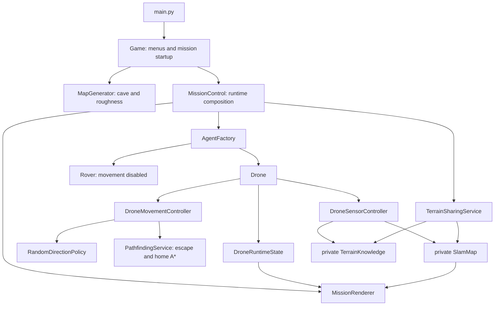
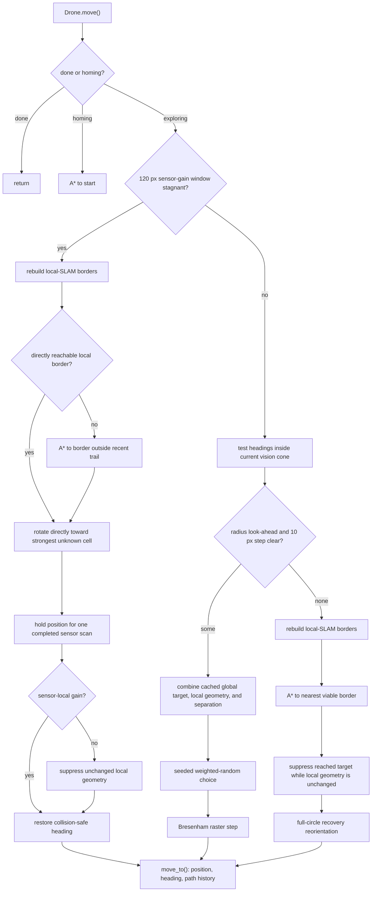

# Cave Game Codeflow Guide

This guide describes the current random-exploration baseline and the runtime
boundaries around it.

## Big Picture

The main thread handles events, sensing, sharing cadence, mission status, and
rendering. Each drone has a worker thread for movement and nearby exchange.
Cave generation and drone A* use process-based workers.

## Startup and Shutdown

1. `main.py` constructs `Game`.
2. The menu builds an immutable `SimulationConfig`.
3. `Game` generates a cave and constructs `MissionControl`.
4. `MissionControl.run()` creates the window-facing runtime, agents,
   pathfinding shared memory, and worker threads.
5. The mission loop updates events, sharing, status, sensors, and rendering.
6. Stop, restart, or exit sets the mission event, releases paused workers,
   joins threads, and shuts down the pathfinding process pool/shared memory.

`MissionControl.__init__()` remains setup-only: the process pool and Pygame
runtime are not started until `_initialize_runtime()`.

## Drone Movement

The current policy deliberately has only two movement mechanisms:

- direct weighted-random exploration in locally open space;
- A* routing for cul-de-sac escape and homing.

### Normal exploration

`DroneMovementController.find_new_node()` tests integer headings within half
the sensor FOV on either side of the current heading. With the current sensor,
that is a 60-degree cone. Circular wraparound is handled at north. A heading is
eligible only when both the radius-length look-ahead and the short step are
collision-free. The controller scores each candidate from a bounded local SLAM
window. It groups unknown cells beside confident free space into deterministic
eight-connected components and excludes components below the normal-heading
12-cell size threshold. Wall-touching components form the strict first tier.
Within that tier, normalized continuation alignment and size rank each carry
weight 2 while proximity carries weight 1. If no wall component is actionable,
generic components use size rank at weight 2 and proximity at weight 1. The
distance-band setting is the soft scale for the proximity term. Small
components remain available to the bounded stagnation recovery path rather
than steering every ordinary step.

The controller also maintains a coarse connected-component index over the
complete local SLAM. It aggregates frontier pixels into configurable 32-pixel
cells and rebuilds at most once per configurable two-second interval when SLAM
has changed. The same strict wall/generic hierarchy and 2:2:1 or 2:1 scoring
select one strategic region. A real frontier-cell centroid inside that region,
not the component's possibly explored geometric center, supplies the bearing.
Only targets beyond the bounded local window activate this signal; per-step
work then evaluates one cached bearing rather than every map frontier.
Local evidence remains a lower-weight tactical correction until the target
enters the local window. A separate
vector repels nearby teammates and uses per-drone launch sectors to break the
initial overlap. `RandomDirectionPolicy` samples the resulting weights with a
generator seeded from the mission seed and drone ID; equal weights retain the
old uniform behavior.

The selected ten-pixel segment is rasterized and traversed directly. Normal
steps do not call A*. Every traversed point goes through
`DroneRuntimeState.move_to()`, which updates position, heading, and the path
history used by rendering.

### Cul-de-sac escape

When no look-ahead heading is available, the controller refreshes borders from
the requesting drone's local `SlamSnapshot`:

- a traversable cell must be `FREE` with confidence at or above the configured
  threshold;
- a border is such a cell adjacent to an unknown or low-confidence cell;
- the configured stride bounds the number of stored targets.

The borders are ordered by distance, with already-near cells deprioritized.
The controller asks `MissionControl.compute_path()` for an A* route to the
first viable target. Failed targets receive a short retry cooldown. A reached
target is locally suppressed until its sampled neighboring frontier geometry
changes, so an unchanged rebuild cannot immediately restore it. At the target,
the drone makes a recovery-only full-circle search for collision-free headings
and rotates toward one before ordinary vision-cone movement resumes. The
chosen exit border remains in runtime state so reorientation cannot be
misread as border exhaustion and trigger premature homing.

### Stagnation recovery

Normal random movement is evaluated in travelled-distance windows using only
sensor-originated newly-known SLAM cells. A productive window leaves the
policy unchanged. When gain falls below the configured cells-per-pixel
threshold, the controller rebuilds local borders and chooses nearby, directly
reachable border cells with unknown neighbors. It rotates exactly toward one
of those unknown cells even when moving along that heading would collide with
the wall. Translation then remains blocked until the sensor has completed that
exact pose once.

If no local heading exposes a border, A* may reach the nearest nonsuppressed
border whose target is outside the breadcrumb suffix accumulated over the same
distance window, then uses the same one-scan wall-facing pose. Sensor-local
gain retains the refreshed frontier geometry; zero gain suppresses unchanged
geometry. A collision-safe full-circle heading is restored before translation
resumes. Stagnation uses sensor gain only, so sharing and collision evidence
cannot hide a locally unproductive loop.

### Homing

When combined confident occupied SLAM covers every exposed wall pixel,
`MissionControl` starts coordinated homing and records
`team_wall_mapping_complete`. The UI displays 100% only for that exact state.
Local border exhaustion still starts an individual drone's homing for backward
compatibility. Homing uses the same A* service to reach `start_pos`. If a
search reaches the fixed expansion cap, the drone follows the best tagged
frontier segment and replans from its endpoint without treating the partial
route as arrival. The drone is marked done only at `start_pos`.

The A* adapter intentionally uses the simulator cave map. That physical
shortcut remains explicit and confined to escape/homing; ordinary wall and
unknown-boundary tracking stays local-SLAM-driven.

## Sensing and SLAM

`MissionControl.update_sensors()` calls each `DroneSensorController` on the
main thread. The controller obtains a pose from `PerfectPoseLocalizer` and
casts a 60-degree cone.

`VisionSensor.scan_cone()` returns:

- dense visible free and occupied cells for SLAM;
- sparse ray hits for the vision overlay and roughness sampling.

Dense observations update only the drone's private `SlamMap`. Terrain samples
update the drone's private `TerrainKnowledge` and are separately recorded in
mission terrain telemetry. Terrain roughness does not influence drone
exploration or wall-mapping completion.

An unchanged pose and heading is not scanned repeatedly. Movement or heading
change produces a new sensor sequence.

## Sharing

`TerrainSharingService` checks drone pairs on a pause-aware cooldown. A pair
must be close and have cave line of sight. An accepted exchange can merge:

- private terrain knowledge;
- private SLAM knowledge.

Frontier coordinates are derived from a particular SLAM version and are not
shared. When a merge changes a recipient's SLAM, its movement controller is
invalidated and rebuilds local borders on the owning thread before checking
whether empty borders should start homing. The coarse global cache is rebuilt
from the merged map on its bounded cadence.

The mission-wide terrain store remains telemetry/UI state, not a drone
decision source. Sharing is the explicit path by which one drone's local
knowledge reaches another.

## Pathfinding

`PathfindingService.start()` copies the cave into shared memory and creates a
bounded `ProcessPoolExecutor`. The compatibility `compute_path()` API returns
only complete unweighted 8-neighbor A* routes. Drones use the structured
segment API, which distinguishes complete, capped-progress, unreachable,
invalid-endpoint, and unavailable-resource outcomes. A capped result contains
the best useful path to the current search fringe; escape and homing follow it
before submitting the next segment. `compute_weighted_path()` remains
available to the disabled rover flow and adds roughness/unknown-confidence
costs.

Both algorithms prevent diagonal movement through a pair of touching wall
corners. `PathfindingService.shutdown()` closes the pool and unlinks shared
memory.

## Rendering

`MissionRenderer.draw()` composes each frame in this order:

1. static background and SLAM/terrain view;
2. drone and rover travelled paths;
3. drone vision overlays;
4. agent icons;
5. debug text and the control center.

`DroneRenderer` owns a persistent transparent path surface. It draws only path
segments added since the previous frame, so the complete breadcrumb trail is
visible without rebuilding the overlay. There is no separate navigation-graph
overlay.

## State Ownership

- `DroneRuntimeState` owns position, heading, border targets, lifecycle flags,
  visibility flags, ray endpoints, and travelled path history under one lock.
- `SlamMap` owns occupancy, confidence, progress counters, and point-cloud
  state under its own lock.
- `TerrainKnowledge` owns roughness and confidence arrays.
- `PathfindingService` owns A* external resources.
- `MissionControl` is the composition root and mission lifecycle owner.
- Renderers consume detached snapshots and do not mutate simulation state.

## Configuration

The live navigation settings are intentionally small:

- `frontier.confidence_threshold`;
- `frontier.stride`;
- `frontier.rebuild_cooldown`;
- `frontier.minimum_cluster_cells`;
- `frontier.distance_band`;
- `frontier.wall_continuation_weight`;
- `frontier.cluster_size_weight`;
- `frontier.cluster_proximity_weight`;
- `frontier.global_cell_size`;
- `frontier.global_refresh_interval`;
- `exploration.policy`, normalized to `random`.
- `exploration.stagnation_distance`;
- `exploration.stagnation_min_sensor_cells_per_px`.
- `exploration.wall_direction_bias`;
- `exploration.unexplored_direction_bias`;
- `exploration.separation_direction_bias`.

Older policy and navigation keys in a local INI are ignored so existing user
configuration files remain loadable. A subsequent save writes only the live
schema.

## Primary Files

- `mission/control.py`: runtime composition and agent-thread entry points.
- `mission/lifecycle.py`: main loop and teardown.
- `agents/drone.py`: per-drone collaborator composition.
- `agents/exploration_policy.py`: seeded weighted-random heading choice.
- `agents/drone_movement.py`: direct steps, border extraction, A* escape/home.
- `agents/drone_runtime_state.py`: synchronized mutable drone state.
- `mapping/drone_sensor.py`: dense vision-to-SLAM and sparse terrain sampling.
- `mapping/terrain_sharing.py`: proximity-based explicit exchange.
- `navigation/pathfinding.py`: pathfinding resource lifecycle.
- `navigation/astar_pathfinder.py`: unweighted and weighted A* algorithms.
- `rendering/agent_renderer.py`: breadcrumb paths, vision, and icons.
- `rendering/mission_renderer.py`: frame composition.
