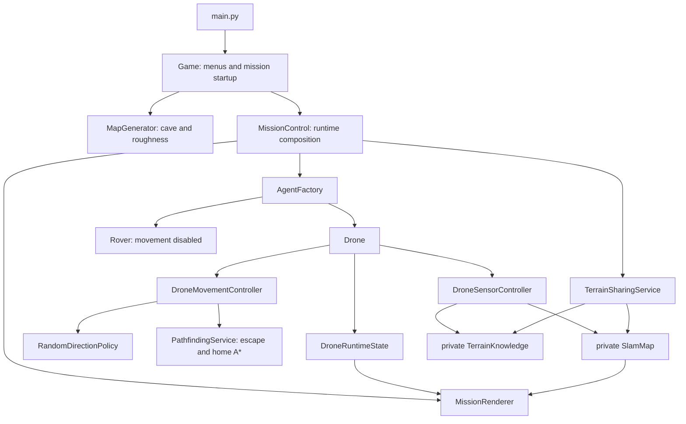
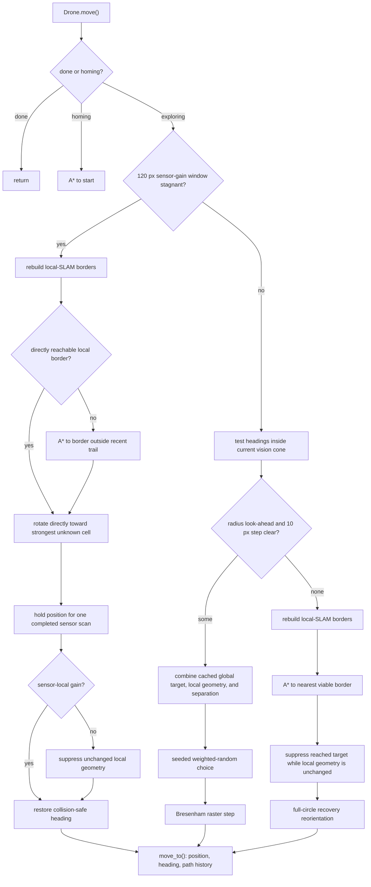

# Cave Game Codeflow Guide

This guide describes the current random-exploration baseline and the runtime
boundaries around it.

## Big Picture

```mermaid
flowchart TD
    Main["main.py"] --> Game["Game: menus and mission startup"]
    Game --> Map["MapGenerator: cave and roughness"]
    Game --> Mission["MissionControl: runtime composition"]
    Mission --> Factory["AgentFactory"]
    Factory --> Drone["Drone"]
    Factory --> Rover["Rover: movement disabled"]
    Drone --> Movement["DroneMovementController"]
    Drone --> Sensor["DroneSensorController"]
    Drone --> State["DroneRuntimeState"]
    Movement --> Random["RandomDirectionPolicy"]
    Movement --> AStar["PathfindingService: escape and home A*"]
    Sensor --> Slam["private SlamMap"]
    Sensor --> Terrain["private TerrainKnowledge"]
    Mission --> Sharing["TerrainSharingService"]
    Sharing --> Slam
    Sharing --> Terrain
    Mission --> Render["MissionRenderer"]
    State --> Render
    Slam --> Render
```

The main thread handles events, sensing, mission status, and rendering. Its
legacy rover-sharing cadence is disabled for sector missions; rover exchange
belongs to arrival and departure. Each drone has a worker thread for movement
and nearby field exchange.
Cave generation and drone A* use process-based workers.

## Startup and Shutdown

1. `main.py` constructs `Game`.
2. The menu builds an immutable `SimulationConfig`.
3. `Game` generates a cave and constructs `MissionControl`.
4. `MissionControl.run()` creates the window-facing runtime, agents,
   pathfinding shared memory, and worker threads.
5. The mission loop updates events, sharing, status, sensors, and rendering.
6. Stop, restart, or exit sets the mission event, releases paused workers,
   joins threads, and shuts down the pathfinding process pool/shared memory.

`MissionControl.__init__()` remains setup-only: the process pool and Pygame
runtime are not started until `_initialize_runtime()`.

## Drone Movement

The current policy deliberately has only two movement mechanisms:

- direct weighted-random exploration in locally open space;
- A* routing for cul-de-sac escape and homing.

```mermaid
flowchart TD
    Tick["Drone.move()"] --> State{"done or homing?"}
    State -->|done| Stop["return"]
    State -->|homing| Home["A* to start"]
    State -->|exploring| Gain{"120 px sensor-gain window stagnant?"}
    Gain -->|no| Headings["test headings inside current vision cone"]
    Gain -->|yes| Refresh["rebuild local-SLAM borders"]
    Refresh --> Local{"directly reachable local border?"}
    Local -->|yes| WallScan["rotate directly toward strongest unknown cell"]
    Local -->|no| TrailRoute["A* to border outside recent trail"]
    TrailRoute --> WallScan
    WallScan --> WaitScan["hold position for one completed sensor scan"]
    WaitScan --> ScanGain{"sensor-local gain?"}
    ScanGain -->|yes| SafeTurn["restore collision-safe heading"]
    ScanGain -->|no| ScanSuppress["suppress unchanged local geometry"]
    ScanSuppress --> SafeTurn
    SafeTurn --> History
    Headings --> Open{"radius look-ahead and 10 px step clear?"}
    Open -->|some| Bias["combine cached global target, local geometry, and separation"]
    Bias --> Choose["seeded weighted-random choice"]
    Choose --> Direct["Bresenham raster step"]
    Direct --> History["move_to(): position, heading, path history"]
    Open -->|none| Borders["rebuild local-SLAM borders"]
    Borders --> Route["A* to nearest viable border"]
    Route --> Suppress["suppress reached target while local geometry is unchanged"]
    Suppress --> Turn["full-circle recovery reorientation"]
    Turn --> History
```

### Normal exploration

`DroneMovementController.find_new_node()` tests integer headings within half
the sensor FOV on either side of the current heading. With the current sensor,
that is a 60-degree cone. Circular wraparound is handled at north. A heading is
eligible only when both the radius-length look-ahead and the short step are
collision-free. The controller scores each candidate from a bounded local SLAM
window. It groups unknown cells beside confident free space into deterministic
eight-connected components and excludes components below the normal-heading
12-cell size threshold. Wall-touching components form the strict first tier.
Within that tier, normalized continuation alignment and size rank each carry
weight 2 while proximity carries weight 1. If no wall component is actionable,
generic components use size rank at weight 2 and proximity at weight 1. The
distance-band setting is the soft scale for the proximity term. Small
components remain available to the bounded stagnation recovery path rather
than steering every ordinary step.

The controller also maintains a coarse connected-component index over the
assigned portion of local SLAM. It aggregates frontier pixels into configurable 32-pixel
cells and rebuilds at most once per configurable two-second interval when SLAM
has changed. The same strict wall/generic hierarchy and 2:2:1 or 2:1 scoring
select one strategic region. A refreshed cache retains the previous region
when its coarse cells still overlap and its score remains within 0.5 of the
new best score; this prevents small score changes from redirecting the drone
every few seconds. Each region first retains its normal
continuation-first wall representative (or nearest generic representative).
The rover's epoch coordinator gives each drone a disjoint coarse territory.
Small gateways into the same connected interior unknown basin are deduplicated
before partitioning; a border-connected basin cannot rescue a small gateway.
The initial multi-source partition is then seeded and rebalanced from estimated
scan, approach, component-dispersion, and terrain effort. Boundary cells move
only when the move reduces estimated effort variance and both owner territories
remain connected.
Local and global candidates outside that assigned sector are filtered out,
while an outward step at an entered sector boundary is strongly penalized. A
real frontier-cell centroid inside that region, not the
component's possibly explored geometric center, supplies the bearing.
Only targets beyond the bounded local window activate this signal; per-step
work then evaluates one cached bearing rather than every map frontier.
Local evidence remains a lower-weight tactical correction until the target
enters the local window. A separate
vector repels nearby teammates and uses per-drone launch sectors to break the
initial overlap. Shared SLAM immediately refreshes exact runtime frontiers but
does not invalidate the strategic cache before its normal cadence expires.
The one exception is the exhaustion check, which bypasses the cadence when
the cache is older than the current SLAM version.
`RandomDirectionPolicy` samples the resulting weights with a
generator seeded from the mission seed and drone ID; equal weights retain the
old uniform behavior.

Each controller also owns a coarse coverage-memory map. Entering a new coarse
cell increments an exponentially decaying cell record, and crossing a coarse
boundary increments a direction-independent edge record. Candidate headings
project one coverage-cell width ahead and multiply their ordinary exploration
weight by the inverse visit/edge pressure. This makes fresh ground preferable
without turning visited corridors into obstacles. The factor is disabled while
the drone is outside its assignment, and mandatory A* ingress, check-in, and
homing routes never consult it. Motion traces report new/revisited cell entries
and repeated edges; heading traces report the selected pressure and factor.

The selected ten-pixel segment is rasterized and traversed directly. Ordinary
steps do not call A*. Every traversed point goes through
`DroneRuntimeState.move_to()`, which updates position, heading, and the path
history used by rendering.

After sector exhaustion, the drone plans its physical rover rendezvous with
A* by default. A capped partial route is followed and replanned from its new
endpoint. The sector breadcrumb suffix is retained as the safety fallback for
an unavailable or failed route. On arrival it exchanges maps once, then stands
by on a per-drone assignment-ready signal. The signal is checked locally by
the movement loop; no rover callback or map exchange is repeated while the
drone waits. A second exchange immediately before departure downloads any map
updates contributed by later arrivals. The mission renderer draws the coordinator's
detached epoch snapshot between the SLAM and path layers: owner-colored cells,
external territory borders, sector seeds, the rover gateway, and dimmed
territories for drones waiting at the barrier.
Exhaustion requires that the assignment was entered at least once, but does not
require the drone's final position to remain inside it. If an out-of-sector
drone is boxed in before exhaustion confirms, it attempts A* to nearby viable
owned-cell points and then a full-circle direct ingress step. Two complete
failures explicitly abandon the assignment and start rover check-in, preventing
a sector-boundary state from blocking the team barrier indefinitely.

### Cul-de-sac escape

When no look-ahead heading is available, the controller refreshes borders from
the requesting drone's local `SlamSnapshot`:

- a traversable cell must be `FREE` with confidence at or above the configured
  threshold;
- a border is such a cell adjacent to an unknown or low-confidence cell;
- the configured stride bounds the number of stored targets.

The borders are ordered by distance, with already-near cells deprioritized.
The controller asks `MissionControl.compute_path()` for an A* route to the
first viable target. Failed targets receive a short retry cooldown. Complete
routes whose routed/direct distance exceeds `maximum_path_circuity` are
suppressed without execution. A reached target is locally suppressed until
its sampled neighboring frontier geometry changes; this memory survives a new
sector assignment and is pruned or reactivated against current SLAM. At the target,
the drone makes a recovery-only full-circle search for collision-free headings
and rotates toward one before ordinary vision-cone movement resumes. The
chosen exit border remains in runtime state so reorientation cannot be
misread as border exhaustion and trigger premature homing.

### Stagnation recovery

Normal random movement is evaluated in travelled-distance windows using only
sensor-originated newly-known SLAM cells. A productive window leaves the
policy unchanged. When gain falls below the configured cells-per-pixel
threshold, the controller rebuilds local borders and chooses nearby, directly
reachable border cells with unknown neighbors. It rotates exactly toward one
of those unknown cells even when moving along that heading would collide with
the wall. Translation then remains blocked until the sensor has completed that
exact pose once. The request sequence is based on the sensor controller's last
fully published completion rather than the SLAM-side counter, which may advance
slightly earlier during a concurrent scan. A three-second simulation-time
watchdog abandons an unmatched request and restores a movement-safe heading, so
a missed completion cannot immobilize the drone indefinitely.

If no local heading exposes a border, A* may reach the nearest nonsuppressed
border whose target is outside the breadcrumb suffix accumulated over the same
distance window, then uses the same one-scan wall-facing pose. Sensor-local
gain retains the refreshed frontier geometry; zero gain suppresses the
unchanged connected sampled component. Before the scan-only turn, the
controller records the travel heading.
It restores that heading when collision-safe or chooses the safe heading with
the smallest angular deviation. Any global-cache rebuild caused by the scan
uses this travel heading rather than the temporary sensing direction.
Stagnation uses sensor gain only, so sharing and collision evidence cannot hide
a locally unproductive loop.

### Homing

When combined confident occupied SLAM covers every exposed wall pixel,
`MissionControl` starts coordinated homing and records
`team_wall_mapping_complete`. It also starts coordinated homing at the
configured 30-pixel residual tolerance and records
`team_wall_mapping_tolerance_reached`; the absolute tolerance is capped at one
percent of the exposed-wall total. The UI displays 100% only for exact
coverage. Local border exhaustion starts an individual drone's homing after
pending shared or late SLAM changes receive one final local-frontier rebuild.
The global frontier cache remains ordinary-exploration guidance and does not
postpone homing. Homing uses the same A* service to reach `start_pos`. If a search
reaches the fixed expansion cap, the drone follows the best tagged frontier
segment and replans from its endpoint without treating the partial route as
arrival. The drone is marked done only at `start_pos`.

The A* adapter intentionally uses the simulator cave map. That physical
shortcut remains explicit and confined to escape/homing; ordinary wall and
unknown-boundary tracking stays local-SLAM-driven.

## Sensing and SLAM

`MissionControl.update_sensors()` calls each `DroneSensorController` on the
main thread. The controller obtains a pose from `PerfectPoseLocalizer` and
casts a 60-degree cone.

`VisionSensor.scan_cone()` returns:

- dense visible free and occupied cells for SLAM;
- sparse ray hits for the vision overlay and roughness sampling.

Dense observations update only the drone's private `SlamMap`. Every visible
free or occupied cell is accepted at uniform confidence `1.0`; occupancy
confidence does not decay with distance inside the cone. Repeating identical
evidence therefore leaves the SLAM version unchanged, while occupied evidence
wins an equal-confidence free/occupied conflict. Terrain samples update the
drone's private `TerrainKnowledge` with their separate distance-weighted
confidence and are recorded in mission terrain telemetry. Terrain roughness
does not influence drone exploration or wall-mapping completion. Uniform
occupancy and scan-local terrain samples use bulk array fusion, and each
`sensor_scan` event reports vision, SLAM, terrain, and total elapsed time.

An unchanged pose and heading is not scanned repeatedly. Movement or heading
change produces a new sensor sequence.

## Sharing

`TerrainSharingService` checks drone pairs on a pause-aware cooldown. A pair
must be close and have cave line of sight. An accepted exchange can merge:

- private terrain knowledge;
- private SLAM knowledge.

Frontier coordinates are derived from a particular SLAM version and are not
shared. When a merge changes a recipient's SLAM, its movement controller is
invalidated and rebuilds local borders on the owning thread before checking
whether empty borders should start homing. The coarse global cache is rebuilt
from the merged map on its bounded cadence.

The mission-wide terrain store remains telemetry/UI state, not a drone
decision source. Sharing is the explicit path by which one drone's local
knowledge reaches another.

The primary rover also owns an accumulated `SlamMap`. A sector transition is
an explicit physical rendezvous: the drone uploads terrain and SLAM, downloads
the rover's team checkpoint, and joins an epoch barrier. Drone-to-drone sharing
is suppressed at the rover. After every drone has arrived, the coordinator
signals assignments without further check-in polling, and
`ExplorationSectorCoordinator` selects separated frontier seeds and
uses a coarse multi-source flood fill over rover-known occupancy/unknown costs
to produce contiguous, disjoint assignments. It first labels eight-connected
frontier and unknown components. A frontier component smaller than the
configured 12 pixels remains eligible when its boundary reaches at least 64
connected unknown cells in a basin that does not touch the map boundary, but
only one such small gateway is retained per eligible basin. This keeps narrow
entrances into real unexplored space without promoting gateways into exterior
unknown space. Stable component IDs are included in each assignment. At the
existing one-time arrival check-in, a drone also reports which assigned
components its local scans suppressed. The rover compares every prior component
with the next checkpoint in a component-sized region. Substantially unchanged
geometry is immediately excluded when that local region gained no confident
cells or the drone reported a confirmed zero-gain directed scan; unrelated map
gain elsewhere cannot preserve it. With no significant novel rover frontier
work, the coordinator ends sector exploration. The trace event
`rover_sector_frontiers_filtered` records raw, retained, rescued, duplicate,
and discarded component counts plus per-component bounds, centroids, basin
IDs, support sizes, boundary connectivity, and dispositions.
`rover_sector_frontier_outcomes` records per-component overlap, local gain,
reported suppressions, and final disposition.
`rover_sector_workload_balanced` records frontier counts, estimated effort, and
the connected boundary transfers used to reduce assignment skew.

## Pathfinding

`PathfindingService.start()` copies the cave into shared memory and creates a
bounded `ProcessPoolExecutor`. The compatibility `compute_path()` API returns
only complete unweighted 8-neighbor A* routes. Drones use the structured
segment API, which distinguishes complete, capped-progress, unreachable,
invalid-endpoint, and unavailable-resource outcomes. A capped result contains
the best useful path to the current search fringe; escape and homing follow it
before submitting the next segment. `compute_weighted_path()` remains
available to the disabled rover flow and adds roughness/unknown-confidence
costs.

Both algorithms prevent diagonal movement through a pair of touching wall
corners. `PathfindingService.shutdown()` closes the pool and unlinks shared
memory.

## Rendering

`MissionRenderer.draw()` composes each frame in this order:

1. static background and SLAM/terrain view;
2. drone and rover travelled paths;
3. drone vision overlays;
4. agent icons;
5. debug text and the control center.

`DroneRenderer` owns a persistent transparent path surface. It draws only path
segments added since the previous frame, so the complete breadcrumb trail is
visible without rebuilding the overlay. There is no separate navigation-graph
overlay. In the occupancy surface, confident free cells are white, occupied
cells are red, and confident free frontier cells bordering unknown SLAM are
yellow. The frontier color uses the same confidence threshold and eight-neighbor
definition as navigation.

## State Ownership

- `DroneRuntimeState` owns position, heading, border targets, lifecycle flags,
  visibility flags, ray endpoints, and travelled path history under one lock.
- `SlamMap` owns occupancy, confidence, progress counters, and point-cloud
  state under its own lock.
- `TerrainKnowledge` owns roughness and confidence arrays.
- `PathfindingService` owns A* external resources.
- `MissionControl` is the composition root and mission lifecycle owner.
- Renderers consume detached snapshots and do not mutate simulation state.

## Configuration

The live navigation settings are intentionally small:

- `frontier.confidence_threshold`;
- `frontier.stride`;
- `frontier.rebuild_cooldown`;
- `frontier.minimum_cluster_cells`;
- `frontier.minimum_unknown_support_cells`;
- `frontier.distance_band`;
- `frontier.wall_continuation_weight`;
- `frontier.cluster_size_weight`;
- `frontier.cluster_proximity_weight`;
- `frontier.global_cell_size`;
- `frontier.global_refresh_interval`;
- `frontier.global_ownership_weight`;
- `frontier.maximum_path_circuity`;
- `exploration.policy`, normalized to `random`.
- `exploration.stagnation_distance`;
- `exploration.stagnation_min_sensor_cells_per_px`.
- `exploration.wall_direction_bias`;
- `exploration.unexplored_direction_bias`;
- `exploration.separation_direction_bias`.
- `exploration.coverage_memory_cell_size`;
- `exploration.coverage_memory_decay_seconds`;
- `exploration.coverage_visit_weight`;
- `exploration.coverage_edge_weight`.

Older policy and navigation keys in a local INI are ignored so existing user
configuration files remain loadable. A subsequent save writes only the live
schema.

## Primary Files

- `mission/control.py`: runtime composition and agent-thread entry points.
- `mission/lifecycle.py`: main loop and teardown.
- `agents/drone.py`: per-drone collaborator composition.
- `agents/exploration_policy.py`: seeded weighted-random heading choice.
- `agents/drone_movement.py`: direct steps, border extraction, A* escape/home.
- `agents/drone_runtime_state.py`: synchronized mutable drone state.
- `mapping/drone_sensor.py`: dense vision-to-SLAM and sparse terrain sampling.
- `mapping/terrain_sharing.py`: proximity-based explicit exchange.
- `mapping/exploration_sectors.py`: rover check-in barrier and dynamic sectors.
- `navigation/pathfinding.py`: pathfinding resource lifecycle.
- `navigation/astar_pathfinder.py`: unweighted and weighted A* algorithms.
- `rendering/agent_renderer.py`: breadcrumb paths, vision, and icons.
- `rendering/mission_renderer.py`: frame composition.
